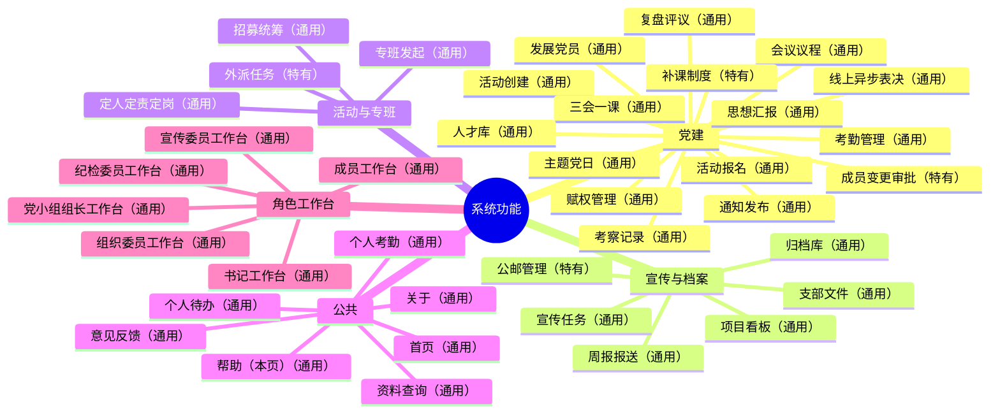

# GSM1921-SOP · 支部成员版

本文件为组织成员使用版（含光华管理学院本科生党支部示例组织的制度与角色细节）；开源项目说明与快速开始见根 [README.md](README.md)。

> 光华管理学院本科生党支部组织操作系统（Org OS）——**一套可复用的学生组织/党支部管理引擎**
> "管理事，服务人"——将组织制度文本转化为可执行的代码工作流，让制度从"写在文档里没人看"变成"嵌入系统中必须遵守"。
>
> **开源可复用**：MIT 许可，任何组织可以按需复用本系统——替换组织数据即可换组织，自定义角色/颜色/术语/扩展能力均有正式入口（见 [九、复用与二次开发](#九复用与二次开发给其他组织)）。

**公网访问：[https://czhgo.github.io/GSM1921-SOP/](https://czhgo.github.io/GSM1921-SOP/)**

---

## 一、这是什么？

GSM1921-SOP 是光华管理学院本科生党支部的组织运行操作系统。它解决一个本科生党支部的现实困境：支委换届频繁，经验随人走、制度随人变；新支委上任后需要数月摸索才能上手；同一种工作在不同人手里做法完全不同；上级检查时找不到合规依据。

这个系统的回答是三件事：

1. **制度即代码** — 所有工作流源自 `content/02_institution/sop/` 制度母本，改一处制度，全系统同步
2. **角色即视图** — 同一数据源，不同角色看到不同的工作视角。每个角色只看到自己该看的事，但所有角色的数据来自同一个真相源
3. **经验可传承** — 每一次决策、每一次执行、每一次从错误中长出的教训，都被记录和沉淀。换届不必"从零开始"，而是站在前人的肩膀上

整套系统由单页制工作台承载日常使用，由 AI 通过 Vibe Coding 模式协作维护与迭代，让制度从文本变成可交互的工具。系统已接入一体化后端（2026-08），账号登录、数据持久化与前端 26 个持久化域全量对称，全链路开发保持同步。

> **开源项目目标（书记 2026-09-03 定位）**：以「把工作流封装成可复用的代码块，由各支部按自己的实际工作流排列组合」为长期演进主线——最终形态是**在界面上拖拽工作流块，系统据此自动封装为可执行的工作流代码**（能力目录化 → 支部组合化 → 块封装契约 → 拖拽编排 → 块分享复用）。设计方向见 [ARCHITECTURE_EVOLUTION.md §八](content/04_web_design/evolution/ARCHITECTURE_EVOLUTION.md)；已落地两级台阶：书记工作台「工作台配置」对业务模块与活动产出块的「清单+画布」启停/排序（2026-09-03）。

---

## 二、怎么开始用？

**路径一：公网演示（最快体验）**

直接访问 [公网地址](https://czhgo.github.io/GSM1921-SOP/)，无需安装。演示环境使用开发演示账号，适合快速了解系统长什么样。

**路径二：本地完整运行**

如果要体验账号登录、数据持久化等完整能力，在本地运行：

```bash
git clone https://github.com/czhgo/GSM1921-SOP.git
cd server
npm install
npm start
```

然后访问 `http://127.0.0.1:3000/login.html` 登录使用（演示账号见 `docs/src/mock/accounts.js`；贡献与工程约定见 [CONTRIBUTING.md](CONTRIBUTING.md)，环境变量模板见 `server/.env.example`）。

**然后呢？**

- 系统主页提供角色选择面板。根据你的身份（党支书、委员、党小组组长或普通成员），进入对应的工作台；普通成员选择"成员工作台"即可查看个人相关信息。
- 工作台是日常使用的工具，但理解"为什么要这样做"需要阅读制度母本和理论文档。第四章按角色给出了阅读路径，第六章讲清了背后的设计理念。

---

## 三、我能用它做什么？

对于支部成员，这套系统提供：

- **活动日历** — 打开系统主页即可看到支部全部活动安排
- **个人考勤查询** — 查看自己的出勤情况
- **个人待办** — 通知、活动、专班自动生成待办事项，提醒你该做什么
- **支委工作透明化** — 查看各支委的工作成果，了解支委在做什么
- **标准流程查阅** — 通过常见工作场景快速指南，了解各类工作的标准做法
- **意见反馈** — 通过系统【意见反馈】入口（`feedback.html`）提交建议

对于支委和党小组组长，系统提供与角色对应的单页制工作台（功能与待办合一，Tab 分组统一为「党建」）：

| 角色 | 工作台（功能分区 + 待办） |
|------|--------------------------------|
| **党支书** | 全局概况（按维度/按人）、常设赋权、事项管理、通知发布、待办（含待答复收件箱） |
| **组织委员** | 专班建设（招募统筹、定人定责定岗）、考察上传、人才库、发展党员、待办 |
| **宣传委员** | 宣传任务、项目看板、档案归档、周报报送、文件外发确认、待办 |
| **纪检委员** | 考勤管理、考察管理、活动监督复盘、补课制度、公邮管理、待办 |
| **党小组组长** | 本组活动组织、考勤上传、考察上传、复盘提交、组员进展、待办 |
| **普通成员** | 成员工作台（活动动态、项目分工、个人考勤、个人待办） |

同一份数据，不同角色看到不同的视角——谁能看到谁，由赋权链（执行委托）计算得出；支部的各项工作都是"管理事，服务人"的工作，统一承载于角色工作台。

---

## 四、我该看什么？

不同角色关心的问题不同，阅读路径也不同。以下按三类角色给出推荐顺序，从最贴近日常使用到最深入的系统治理。

| 角色 | 阅读顺序 |
|------|---------|
| **普通成员** | 本 README → [党支书工作交接文档](content/01_strategy/SECRETARY_DIRECTIVES.md)（理解支部为什么这样运作）→ [常见工作场景快速指南](content/02_institution/sop/常见工作场景快速指南.md) → 系统工作台 |
| **支委 / 党小组组长** | 本 README → [党支书工作交接文档](content/01_strategy/SECRETARY_DIRECTIVES.md) → [对应角色的工作流程指南](content/02_institution/sop/INDEX.md) → 系统对应工作台 → [ARCHITECTURE.md](content/03_doc_system/ARCHITECTURE.md)（如需了解架构） |
| **系统维护者** | 本 README → [ARCHITECTURE.md](content/03_doc_system/ARCHITECTURE.md)（核心架构说明）→ [CLAUDE.md](CLAUDE.md)（项目治理文件）→ [server/README.md](server/README.md)（后端服务说明）→ [OPERATIONS_GUIDE.md](content/03_doc_system/OPERATIONS_GUIDE.md) → [DOC_MAP.md](content/03_doc_system/DOC_MAP.md) → [SSOT_INDEX.md](content/03_doc_system/SSOT_INDEX.md)（母本子本注册表） |

如果你带着具体问题而来，下表帮你快速定位权威文档。

| 你想了解... | 看这份文档 |
|------------|----------|
| 项目是什么 | [README.md](README.md)（本文件） |
| 架构是什么 | [ARCHITECTURE.md](content/03_doc_system/ARCHITECTURE.md) — 分层模型、数据模型、变更流水线 |
| 制度在哪 | [content/02_institution/sop/INDEX.md](content/02_institution/sop/INDEX.md) — 各角色工作流程指南导航 |
| 理论在哪 | [SECRETARY_DIRECTIVES.md](content/01_strategy/SECRETARY_DIRECTIVES.md) + [DEVELOPMENT_PATH.md](content/01_strategy/DEVELOPMENT_PATH.md) + [content/insights/](content/insights/) |
| 工作流是什么 | [CLAUDE.md](CLAUDE.md) — 项目最高治理文件，定义工作方式、核心原则和运行标准 |
| 系统怎么跑起来 | [server/README.md](server/README.md) — 安装、启动、测试与部署对接 |
| 系统怎么验证 | `cd server && npm test` — 全量测试随 `server/test/` 增长（E2E/单元/审计），详见 [server/README.md](server/README.md) 测试说明 |

---

## 五、出问题怎么办？

**报告问题**

在 GitHub Issues 中创建新 Issue，标题格式建议 `[SOP]/[UI]/[Doc] 简要描述`，标注问题所属的层面。如果是流程改进建议，可通过系统【意见反馈】入口（`feedback.html`）提交，由支部负责人确认后执行全局修复。

**查找已有答案**

支部在长期运行中沉淀了大量经验和决策记录，许多"为什么"的问题已有答案：

- **执行日志**（`.ctx/logs/YYYY-MM-EXECUTION_LOG.md`）记录了每次工作做了什么、改了哪些文件
- **决策日志**（`.ctx/logs/DECISION_LOG.md`）记录了每一次非显而易见决策的背景、选项和理由——理解"为什么选 A 不选 B"
- **经验沉淀**（[content/insights/](content/insights/)）是历届支委集体萃取的组织智慧

制度不是凭空产生的——每一条规则背后都是一次选择。选择意味着放弃，被放弃的方案、被纠正的认知、被淘汰的设计都记录在决策日志中。不了解"为什么不是那样"，就无法真正理解"为什么是这样"。

**术语不明时**

遇到不熟悉的术语（如"条块二元""专班""三支委"等），查阅 [USAGE_POLICY.md](content/03_doc_system/USAGE_POLICY.md)——它是全仓库术语的权威源，所有文档使用的术语都以它为准。

---

## 六、设计理念

这个系统以一套完整的设计理念为支撑，而非工具的堆砌。以下按"从总纲到具体"的顺序展开：先讲系统为什么存在，再讲设计遵循的元原则与验收标准，最后是支撑运行的具体理念。

### 总纲 · "管理事，服务人"

系统最重要产出是"从入党申请人到正式党员"的完整叙事，而非某个功能模块。各种发展轨迹的同学都能加入支部，通过组织获得各自的成长；支部的各项工作都是"管理事，服务人"的工作，任何一名党员（包括支委会在内）在管理事和服务人两方面都各有职责与成长空间。

→ [DEVELOPMENT_PATH.md](content/01_strategy/DEVELOPMENT_PATH.md)（完整叙事）+ [SECRETARY_DIRECTIVES.md](content/01_strategy/SECRETARY_DIRECTIVES.md)（P-002/P-003 元命题）

### 元原则 · 最小三成本

任务流默认直接展示在工作台，不要求用户额外操作才能看到"我需要做什么"。包含三个维度：**信息成本**（获取"我需要做什么"所需的信息搜寻成本）、**操作成本**（从进入工作台到看到可执行事项的点击次数）、**适应学习成本**（新用户理解分工、任务与信息流的学习成本）——系统设计让用户以最低成本完成任务。

→ [DESIGN_SYSTEM.md](content/04_web_design/design-system/DESIGN_SYSTEM.md) §一 原则 2

### 验收标准 · 高频零跳转

最小三成本的最终验收标准：**完成一个高频工作需要操作多少次？信息展示与操作是否同地？** 答复类置顶待办、工作概况三区总览、行内填写即发——让"看到"与"操作"在同一可视区域，而不是藏在多层之下。

→ [DESIGN_SYSTEM.md](content/04_web_design/design-system/DESIGN_SYSTEM.md) §一 原则 10

### 按人视图 · 知情边界

谁能看到谁，由赋权链（执行委托）计算得出，不靠人工判断——**信息可见性 = 职责空间的投影**。看 ≠ 做：可见性只决定"能看到什么维度"，不授予任何操作权；上级对下级仅"了解进展"与答复，无编辑他人待办入口。这是分工的运行保障中的做与看。

→ [SECRETARY_DIRECTIVES.md](content/01_strategy/SECRETARY_DIRECTIVES.md)（P-012）+ [DESIGN_SYSTEM.md](content/04_web_design/design-system/DESIGN_SYSTEM.md) §一 原则 9

### 工作台与「党建」功能分区

支部的各项工作——三会一课、主题党日、专班、共建活动、发展党员、民主评议、换届选举、考勤考察等——统一承载于各角色工作台（Tab 分组统一为「党建」），都是"管理事，服务人"的工作。

→ [USAGE_POLICY.md](content/03_doc_system/USAGE_POLICY.md) §一（术语权威源，含 2026-09-03 书记裁定）

### 专班

跨小组跨职能抽调人手、不限时间不限地点、集中推进某项工作的组织形式。专班是活动之外考察积极分子的载体，赋权是运行支撑机制，工作量记录是运行保障机制；发起是提出需求，招募是统筹执行，两者分离。

→ [COMMISSIONER_DUTY_FRAMEWORK.md](content/02_institution/COMMISSIONER_DUTY_FRAMEWORK.md) §A

### 扁平化设计

组织者和深度参与者之间无上下级，只是分工不同；组织者的分工记录职责是做好分工记录，深度参与者承担具体分工。扁平化不等于没有"程序"——分工、流程、记录、复盘依然有规律。

→ [FLAT_ORGANIZATION_DESIGN.md](content/02_institution/FLAT_ORGANIZATION_DESIGN.md)

### 条块二元

"条"与"块"是理解权责关系的方式：从职能视角看，三委员按专业职能分工（条）；从单元视角看，党小组组长按小组划分（块）。谁做什么，由岗位职责定义决定，不由条块推出；书记是条块间的协调节点。

→ [SECRETARY_DIRECTIVES.md](content/01_strategy/SECRETARY_DIRECTIVES.md)（P-011）

这些理念构成每一条制度设计背后的理由，而非抽象的口号。理解了它们，才能理解为什么系统是这样组织的，也才能在场景变化时判断原则在什么条件下成立。

→ 完整的理论阐述见 [党支书工作交接文档](content/01_strategy/SECRETARY_DIRECTIVES.md)（17 条论断，按「价值目标 → 组织机制 → 人的成长 → 组织再生产」四层组织，其中 P-002/P-003/P-017 为元命题）和 [DEVELOPMENT_PATH.md](content/01_strategy/DEVELOPMENT_PATH.md)

---

## 七、系统架构与部署

整套系统由"静态前端 + Node 一体化后端"组成：

| 层 | 位置 | 职责 |
|----|------|------|
| **前台（页面）** | `docs/`（16 个页面：10 个根页面 + 6 个 workspace 工作台） | 页面骨架，零硬编码逻辑 |
| **中台（逻辑）** | `docs/src/entries/`（66 个 entry JS：16 根 + tabs/ 50）+ `components/`（33 js + 1 css）+ `core/`（17 个）+ `modules/`（12 个）+ `workflow/`（6 个） | 角色面板路由、视图切换、DOM 渲染 |
| **后台（服务）** | `docs/src/services/`（25 个 service JS）+ `docs/src/mock/`（11 个） | 数据 CRUD、权限计算、持久化 |
| **后端（server/）** | `server/`（Express + better-sqlite3 单进程） | 同源托管静态页面 + `/api/v1` REST（认证 / 32 资源表 / 附件上传 / 快照持久化） |
| **母本层** | `content/02_institution/sop/` | 所有代码逻辑的制度来源 |

数据变更遵循铁律：`content/02_institution/sop/ → docs/src/services/ → docs/src/entries/ → docs/`，所有数据变更必须经过服务层，UI 层禁止直接操作数据源。修改代码前必须确认 SOP 母本已更新。详细架构约束见 [ARCHITECTURE.md](content/03_doc_system/ARCHITECTURE.md)。

**部署方式**

- **公网演示**：GitHub Pages 静态托管 `docs/`（开发演示账号模式，无需后端）
- **本地完整运行**：`cd server && npm start`，访问 `http://127.0.0.1:3000/login.html`，浏览器全链路工作（登录 → API → 数据持久化）
- **北大计算中心对接**：`docs/` 与 `server/` 部署到同一 Web 根目录，统一反向代理转发 `/api/v1/`，见 [server/README.md](server/README.md) 与 [DEPLOYMENT_GUIDE.md](content/04_web_design/deploy/DEPLOYMENT_GUIDE.md) §三（计算中心对接全案）

---

## 八、迭代路线图

| Phase | 状态 | 内容 |
|-------|------|------|
| Phase 1 — Static OS | ✅ 已完成 | GitHub Pages 静态部署 + 14 页面 MPA + 角色工作台与「党建」功能分区 |
| Phase 2 — 后端基建 | ✅ 已完成（2026-08） | Node 一体化后端（Express + better-sqlite3）+ 账号认证 + 25 资源表全栈对称 + 数据持久化 |
| Phase 2.5 — 减负空间 | 🔄 分批进行 | 系统性精简工作流冗余环节与信息冗余，持续降低最小三成本（第一批已完成：KPI 异化修复 / 文件流闭环 / 金色统一 / 切换冗余清理） |
| Phase 3 — Workflow Engine | 规划中 | 工作流自动实例化 + 提醒推送 + 审计报告 |

---

## 九、复用与二次开发（给其他组织）

> 本系统按"可复用"设计：**组织数据、角色权限、主题色、术语、功能扩展都有正式入口**。其他组织/学生团体可按需取用，不必改动系统骨架。以下按"从易到难"给出复用路径。

### 9.1 三种部署形态（任选其一）

| 形态 | 怎么用 | 适用 |
|------|--------|------|
| **A · 纯静态** | `docs/` 直接部署到任意静态托管（GitHub Pages/Netlify/Nginx），无需后端 | 体验、演示、轻量使用（数据存浏览器本地，刷新丢失） |
| **B · 自托管完整版** | `cd server && npm install && npm start`（Express + SQLite 单文件），页面与 API 同源 | 正式使用：账号登录、数据持久化 |
| **C · 对接自有后端** | 前端数据层一个配置切到 `api` 模式，UI 零改动 | 已有后端/计算中心托管（见 [DEPLOYMENT_GUIDE.md](content/04_web_design/deploy/DEPLOYMENT_GUIDE.md)） |

部署形态在 `docs/src/config/deploy.js` 一个常量切换（`static` / `server`），页面按形态自动调整。

### 9.2 换组织数据（最快见效）

组织数据集中在 `docs/src/mock/`（10 个数据文件：人员/活动/通知/专班/任务/考勤等）+ `docs/src/mock/seed.js`；服务端种子 `server/seed.js` 复用同一份数据。**替换这些文件即可换成你的组织数据**，无需改任何逻辑。人员字段含姓名/学号/角色/党小组/发展阶段等，按需增删。

### 9.3 自定义角色与权限（单一事实源）

角色清单是**单一事实源**：`docs/src/core/constants.js` 的 `ROLE_KEYS`（9 个业务键 + 3 个遗留键）。从这里出发，系统自动派生：

```
ROLE_KEYS（改这里）
  → 能力注册表 requiredRoles（谁能用哪个能力）
  → 侧边栏可见性（谁看到哪个入口）
  → 主题色/角色色（谁用什么颜色）
```

改角色/加角色：只改 `ROLE_KEYS` + 对应工作台能力声明，其余自动跟随（收敛设计档案见 [ROLE_PERMISSION_DESIGN.md](content/04_web_design/evolution/ROLE_PERMISSION_DESIGN.md)，已落地 2026-09-03，作为设计论证档案保留）。

### 9.4 自定义主题色与术语

- **主题色**：侧边栏「主题选择」色板（`ACCENT_PALETTE`）可换角色主题色；品牌色（党徽金/党建红）在 `core/constants.js` 定义
- **术语**：全仓库术语权威源 `content/03_doc_system/USAGE_POLICY.md`——改术语即改此文件 + 全局引用
- **深色模式**：遵循 [DESIGN_SYSTEM.md §七](content/04_web_design/design-system/DESIGN_SYSTEM.md) 色块平行性总则，改色后须过自查清单

### 9.5 插件化扩展（能力注册表）

系统 UI 层已插件化（M1-M5）：**功能 = 能力声明**，通过注册表注册（`register` → `get` → `mount`），消费点从清单读取自动发现。

- **新增工作台 tab**：写一个 tab 模块 + 注册能力，入口薄壳自动加载（无需改多处 HTML/entry）
- **新增数据源/场景**：注册为能力（env/deps/apply），按环境启用
- **新增功能开关/灰度**：能力声明携带 scope/role/env，可按部署形态与角色选择性启用

架构演进记录见 [ARCHITECTURE_EVOLUTION.md](content/04_web_design/evolution/ARCHITECTURE_EVOLUTION.md)。

### 9.6 二次开发约定

| 事项 | 约定 |
|------|------|
| 架构 | 分层：`docs/src/entries → components → services → core → mock → workflow`；数据变更必须经服务层，UI 禁止直改数据源 |
| 母本优先 | 制度文本（`content/02_institution/sop/`）是代码逻辑的母本——先改制度，再同步代码 |
| 测试 | `cd server && npm test`——全量测试随 `server/test/` 增长（E2E/单元/审计），覆盖登录链路/死链/数据完整性/模块加载 |
| 版本管理 | `docs/scripts/bump-version.mjs` 一键同步全站 `?v=` 版本戳（避免浏览器缓存分裂） |
| 设计规范 | 改 UI 前必读 [DESIGN_SYSTEM.md](content/04_web_design/design-system/DESIGN_SYSTEM.md)（含可验证条件自检）；可点击落点见 [CLICK_ROUTING.md](content/04_web_design/design-system/CLICK_ROUTING.md) |
| 在线演示 | `docs/` 静态部署即得演示版（演示账号，无需后端） |

### 9.7 完整文档导航

复用者/维护者的完整阅读路径：本 README → [ARCHITECTURE.md](content/03_doc_system/ARCHITECTURE.md)（核心架构）→ [DEPLOYMENT_GUIDE.md](content/04_web_design/deploy/DEPLOYMENT_GUIDE.md)（部署与对外对接总案）→ [server/README.md](server/README.md)（后端与测试）→ [DOC_MAP.md](content/03_doc_system/DOC_MAP.md)（全部文档导航）。

---

### 功能地图

<!--FUNC-MAP:START-->



<!--FUNC-MAP:END-->

## License

This project is licensed under the [MIT License](LICENSE).

参与开发请先读 [CONTRIBUTING.md](CONTRIBUTING.md)（工程纪律与提交约定）。
