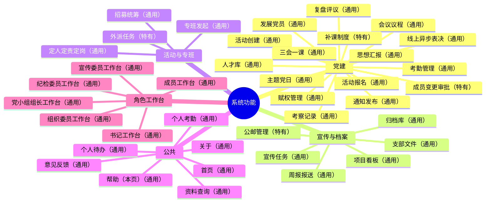

# GSM1921-SOP · 支部成员版

本文件为组织成员使用版（含光华管理学院本科生党支部示例组织的制度与角色细节）；开源项目说明与快速开始见根 [README.md](README.md)，后端服务说明见 [server/README.md](server/README.md)。

> 光华管理学院本科生党支部组织操作系统（Org OS）——**一套可复用的学生组织/党支部管理引擎**。
> "管理事，服务人"：把制度从"写在文档里没人看"变成"嵌入系统中必须遵守"，日常运行有章可循、换届经验不散。

**公网访问：[https://czhgo.github.io/GSM1921-SOP/](https://czhgo.github.io/GSM1921-SOP/)**

---

## 一、这是什么？

支部工作最怕的是：换届频繁、经验随人走；同一种工作不同人做法不同；上级检查找不到合规依据。这套系统把支部的制度、流程、留痕都做成**日常使用的工具**，让每个角色打开工作台就知道"今天该做什么、按什么标准做、做完留什么记录"。

- **制度即代码** — 所有工作流源自制度母本（[content/02_institution/sop/](content/02_institution/sop/)），改一处制度，全系统同步
- **角色即视图** — 同一份数据，不同角色看到自己该看的视角；谁能看到谁由赋权关系自动算出，看得见不等于能操作
- **经验可传承** — 每次决策、执行、复盘都留痕（[.ctx/](.ctx/)），新支委不用从零摸索

系统由「静态前端 + 可选一体化后端」组成（2026-08 起账号登录、数据持久化与前端 26 个持久化域全量对称）。

---

## 二、怎么开始用？

打开系统后先**登录**（首页点「登录」，用你的学号+密码；演示环境也可点页面上的角色卡片直接进入）。登录后**直达你角色对应的"今天"页**——这是每天打开系统的第一站。

**路径一：公网演示（最快体验）**

访问 [公网地址](https://czhgo.github.io/GSM1921-SOP/)，演示账号与说明见根 [README.md](README.md)。

**路径二：本地完整运行（账号登录 + 数据持久化）**

```bash
git clone https://github.com/czhgo/GSM1921-SOP.git
cd server
npm install
npm start
```

访问 `http://127.0.0.1:3000/login.html` 登录使用。

**然后呢？** 登录后落在「今天」页；想找自己负责的事去「待办」，想回顾最近工作去「工作概况」，各角色另有对应的职责页（如委员的"考勤管理/宣传任务"，组长的"活动管理/考勤上传"，成员的"思想汇报"）。理解"为什么要这样做"可读第四章的阅读路径。

---

## 三、我能用它做什么？（怎么用要点）

### 每天打开：今天页

登录直达。只读速览三块：**今天有会**（点一下就跳活动页）、**今天到期**（你的待办里今天要处理的）、**今日分工**。有逾期会红字置顶提醒。这一页不处理事项，所有点击都直达处理处，≤1 次跳转。

### 待办页：按"工作类型"分 9 个抽屉

待办不再是一长串混合清单，而是按工作类型折成 **9 个域**：①会务 ②活动/项目 ③考勤纪律 ④考察 ⑤成员发展 ⑥专班 ⑦决议上报 ⑧归档宣传 ⑨汇报反馈。页顶有「未读通知 N 条」条；点域头展开/收起，域名旁有数量、逾期红点。

> 成员变更（发展阶段变更/在册状态/移出）在「成员发展」域内集中处理：**组织委员报送 → 书记确认**才生效，可勾选多条**批量确认**；退回必须填写意见。每一步都有谁发起、谁确认、什么时间的留痕。

### 待办里常见的几类事

- **活动/会议**：报名、参与、考勤、复盘等按流程自动变成待办
- **确认类**：如纪检确认考勤/考察、宣传确认考勤备案接收——确认后待办自动销项
- **退回重做**：被退回的事项会带退回意见回到你这里，改好再交

### 思想汇报：提交 → 组织初阅 → 通过归档 / 退回重交

在「思想汇报」页提交后，先由**组织委员初阅**：通过即自动归档到你的个人档案（不需要你再操作）；如需修改会**退回并附意见**，你按意见修改后**重新提交**即可。

### 党小组组长：党小组会的考勤由你上传

组长在「考勤上传」页为本组党小组会上传考勤（会前可先确认应到名单）；纪检委员**只读掌握**各党小组会考勤、不代传不改录。组员的进展与待答复汇报在「组员进展」页处理。

### 资料查询：查制度、查支部文件

搜索页（search）可查制度、支部文件、归档与参考资料。**支部文件支持版本化**：上传新版后旧版归档仍可查，文件有现行/停用状态——制度文本类的新建由书记负责，普通文件按既有权限可上传。

### 意见反馈：随时提

遇到问题或改进建议，点【意见反馈】提交；被指派处理的人会在「我的处置」收到并答复（组长台在「组员进展」内答复本组组员）。

### 各角色工作台一览

| 角色 | 工作台里有什么（职责页） |
|------|------------------------|
| **书记 / 副书记** | 今天、待办、全局概况（按维度/按人）、活动管理、支部分工、赋权管理、通知发布、专班查看、党小组进展、反馈管理、上报党委（支部治理在 设置→支部治理） |
| **组织委员** | 考察上传、思想汇报（初阅）、专班管理、成员名册、人才库、发展数据、活动查看 |
| **宣传委员** | 宣传任务、项目看板、周报报送、档案归档 |
| **纪检委员** | 考勤管理、活动监督复盘、考察管理（确认）、公邮管理、补课制度、专班查看 |
| **党小组组长** | 活动管理、考勤上传、考察上传、组员进展、专班查看 |
| **普通成员** | 项目分工、活动动态、考勤概况、我的考察、思想汇报、我的复盘 |
| **党委组织员** | 治理总览、支部监控台账、上报审批、支部管理、下发通知、支部配置 |

同一份数据，不同角色看到不同的视角——谁能看到谁，由赋权链计算得出；看得见 ≠ 能操作。

### 想调字号、换主题、改页签顺序？去侧边栏右下角「设置」

登录后每页侧边栏底部有齿轮图标「设置」，那是设置中心——能看到哪些分区跟着身份走：

- **外观（人人可用）**：字号、明暗主题、强调色，调完全站立刻生效。没登录时偏好存在本浏览器；登录后跟着你的账号走（换设备/换人互不影响）。
- **我的工作台（登录用户）**：把你工作台页签的顺序调成顺手的（常用页签往前放），只对自己生效；默认沿用支部默认顺序，「今天 / 待办」等核心页签固定不动。
- **支部治理（按角色分区）**：书记 / 副书记在这里做「支部信息与换组织向导 / 工作台默认顺序 / 支部制度参数」（副书记与书记同权限）；纪检 / 组织 / 组长各自有「域参数」卡，调自己那一域的参数（可管则见）；普通成员、访客看不到别人的治理区。

> 支部治理原来在书记工作台里的入口，已收口到设置中心——书记工作台不再有「支部配置」页签，需要换组织 / 配模块时点侧边栏右下角「设置 → 支部治理」。

---

## 四、我该看什么？

| 角色 | 阅读顺序 |
|------|---------|
| **普通成员** | 本文件 → [党支书工作交接文档](content/01_strategy/SECRETARY_DIRECTIVES.md)（支部为什么这样运作）→ [常见工作场景快速指南](content/02_institution/sop/常见工作场景快速指南.md) → 系统工作台 |
| **支委 / 党小组组长** | 本文件 → 交接文档 → [对应角色的工作流程指南](content/02_institution/sop/INDEX.md) → 系统工作台 → [ARCHITECTURE.md](content/03_doc_system/ARCHITECTURE.md)（如需了解架构） |
| **系统维护者** | 本文件 → [ARCHITECTURE.md](content/03_doc_system/ARCHITECTURE.md) → [CLAUDE.md](CLAUDE.md)（项目治理）→ [server/README.md](server/README.md)（后端与测试）→ [DOC_MAP.md](content/03_doc_system/DOC_MAP.md) |

带着具体问题而来时：

| 你想了解... | 看这份文档 |
|------------|----------|
| 系统怎么用（操作级手册，含 7 台导览/9 域手册） | 系统内【帮助】页（help.html） |
| 架构是什么 | [ARCHITECTURE.md](content/03_doc_system/ARCHITECTURE.md) |
| 制度在哪 | [content/02_institution/sop/INDEX.md](content/02_institution/sop/INDEX.md) |
| 理论/为什么 | [SECRETARY_DIRECTIVES.md](content/01_strategy/SECRETARY_DIRECTIVES.md) + [DEVELOPMENT_PATH.md](content/01_strategy/DEVELOPMENT_PATH.md) + [content/insights/](content/insights/) |
| 术语不明 | [USAGE_POLICY.md](content/03_doc_system/USAGE_POLICY.md)（全仓库术语权威源） |
| 系统怎么验证 | `cd server && npm test`，测试说明见 [server/README.md](server/README.md) |

---

## 五、出问题怎么办？

**报告问题**：在 GitHub Issues 创建 Issue（标题建议 `[SOP]/[UI]/[Doc] 简要描述`）；流程改进建议走系统【意见反馈】，由支部负责人确认后执行。

**查找已有答案**：支部长期运行沉淀了大量记录——执行日志（`.ctx/logs/`）记每次工作做了什么；决策日志（`DECISION_LOG.md`）记"为什么选 A 不选 B"；[content/insights/](content/insights/) 是历届支委萃取的经验。不了解"为什么不是那样"，就无法真正理解"为什么是这样"。

---

## 六、设计理念

- **总纲 · "管理事，服务人"**：支部最重要产出是"从入党申请人到正式党员"的完整成长叙事；各项管理都是为了服务人的成长
- **最小三成本**：让"看到我该做什么"的信息成本、操作成本、学习成本都最低
- **高频零跳转**：看到与操作在同一可视区，答复类置顶、行内填写即发
- **按人视图 · 知情边界**：信息可见性 = 职责空间的投影；看 ≠ 做，上级对下级只"了解进展"与答复，无编辑他人待办入口
- **专班**：跨小组跨职能集中推进某项工作的组织形式；发起是提需求、招募是统筹执行，两者分离
- **扁平化与条块二元**：组织者与深度参与者只是分工不同；从职能视角三委员按条分工、从单元视角组长按块划分，书记是协调节点
- **确认闭环**：每件事都要有回执、有状态回读，任务不悬空（书记倡导的 closed-loop 表达）

完整阐述见 [党支书工作交接文档](content/01_strategy/SECRETARY_DIRECTIVES.md)（17 条论断）与 [DEVELOPMENT_PATH.md](content/01_strategy/DEVELOPMENT_PATH.md)。

---

## 七、系统架构与部署

| 层 | 位置 | 职责 |
|----|------|------|
| **前台（页面）** | `docs/`（19 页：12 根页 + 7 工作台） | 页面骨架，零硬编码逻辑 |
| **中台（逻辑）** | `docs/src/entries/` + `components/` + `core/` + `modules/capabilities/` | 角色工作台路由、视图渲染、能力注册 |
| **后台（服务）** | `docs/src/services/` + `mock/` | 数据 CRUD、权限计算、持久化 |
| **后端（可选）** | `server/`（Express + better-sqlite3 单进程） | 同源托管静态页 + `/api/v1` REST（账号登录、数据持久化） |
| **母本层** | `content/02_institution/sop/` | 所有代码逻辑的制度来源 |

数据变更遵循铁律：`content/02_institution/sop/ → docs/src/services/ → docs/src/entries/ → docs/`，UI 层禁止直改数据源。

**部署方式**：公网演示（GitHub Pages 静态托管 `docs/`）；本地完整运行（`cd server && npm start` → `http://127.0.0.1:3000/login.html`）；对接部署（`docs/` 与 `server/` 同 Web 根、反代转发 `/api/v1/`，见 [DEPLOYMENT_GUIDE.md](content/04_web_design/deploy/DEPLOYMENT_GUIDE.md)）。

---

## 八、迭代路线图

| 阶段 | 状态 | 内容 |
|------|------|------|
| 页面与工作台体系 | ✅ 已完成 | 12 根页 + 7 工作台（19 页）；登录直达「今天」；9 域待办；支部配置向导 5 步 |
| 后端基建 | ✅ 已完成（2026-08） | Node 一体化后端 + 账号认证 + 26 持久化域对称 + 数据持久化 |
| 治理与减负 | 🔄 分批进行 | 党委工作台（监控/审批/下发）与上报双向通道；9 域待办（C1）、批量确认去顶卡、卡片收敛、性能缓存与渲染守卫等减负批次 |
| 确权与闭环 | 🔄 分批进行 | 发展党员双确权（报送→审批→确认）、思想汇报把关式初阅、决议自动督办、`?reset=init` 一键初始化 |
| 长期演进 | 规划中 | 工作流块化 → 界面拖拽编排 → 跨组织分享复用（能力目录化→组织组合化→块封装→拖拽编排→分享） |

---

## 九、复用与二次开发（给其他组织）

本系统按"可复用"设计：**换组织数据即换组织**，不必改动系统骨架（根 [README.md](README.md) 的「替换入口总表」是完整索引）。支部内部视角的逐项替换：

1. **数据**：人员/活动/通知/专班/考勤/档案集中在 `docs/src/mock/`，整体替换即换组织（`accounts.js` 换登录账号）
2. **角色与权限**：角色清单单一事实源 `docs/src/core/constants.js`，系统自动派生侧边栏/配色/能力门
3. **配色与术语**：设置中心「外观」换明暗主题与强调色（侧边栏右下角 设置 → 外观，全站即时生效）；术语权威源 `content/03_doc_system/USAGE_POLICY.md`（党建红/党徽金为固定合规底线）
4. **支部配置**：侧边栏右下角 设置 → 支部治理（书记 / 副书记，副书同权）或 wizard.html 内 5 步向导可视化完成（模块启停、分工、术语指引、验证重置）
5. **正式起步**：试用后用 `?reset=init` 一键初始化（清业务数据、留组织骨架），或转 API 形态持久化

架构演进记录见 [ARCHITECTURE_EVOLUTION.md](content/04_web_design/evolution/ARCHITECTURE_EVOLUTION.md)。

---

### 功能地图

<!--FUNC-MAP:START-->



<!--FUNC-MAP:END-->

## License

This project is licensed under the [MIT License](LICENSE).

参与开发请先读 [CONTRIBUTING.md](CONTRIBUTING.md)（工程纪律与提交约定）。
