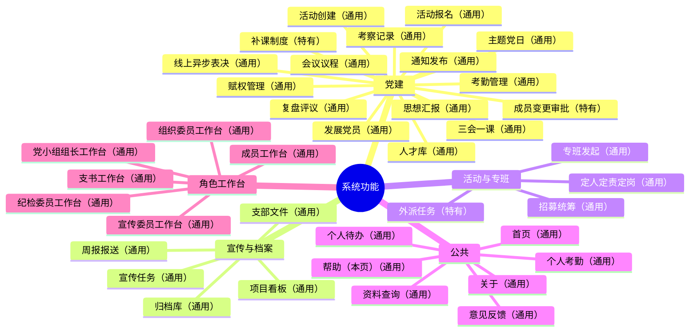

# GSM1921-SOP

制度即代码的组织运行系统引擎——把制度文本从"写在文档里没人看"变成"嵌入系统中必须遵守"：日常运行有章可循、有据可查、换届不散。

> 本系统最初以**光华管理学院本科生党支部**的工作流为基础打磨；随持续迭代逐步通用化——现面向各类党支部与学生组织 / 师生组织，**任何组织都可以部署属于自己的一份**（自有名称、成员与账号、制度文本、角色分工、主题配色与后端数据），彼此独立、互不影响。
>
> 仓库随附的**示例组织**（即最初打磨所用的本科生党支部示例数据）仅用于开箱即跑与完整演示，是可整体替换的默认值，不代表本系统的适用范围。

- **组织内部使用 · 使用者视角**：[README-members.md](README-members.md)
- **后端服务说明**：[server/README.md](server/README.md)

MIT · Node ≥ 22 · 原生 ESM（无打包器/无构建步骤）· 纯本地数据可离线 · 可选 Node 一体化后端

---

<!--FUNC-MAP:ANCHOR-->

## 功能地图

> 通用能力与组织特有能力以（通用）/（特有）文本标注区分；本图由 `node docs/scripts/gen-function-mermaid.mjs --write` 从 docs/src/core/function-catalog.js 生成，勿手改（完整四章含业务链路/架构分层/服务依赖用同脚本 stdout 打印）。

<!--FUNC-MAP:START-->



<!--FUNC-MAP:END-->

## 一、你的部署（每个组织自己的实例）

- **你看到的公网演示**（<https://czhgo.github.io/GSM1921-SOP/>）只是**示例组织的一个部署**，用于试用体验——不是本系统的唯一形态。
- **每个组织部署自己的实例**：组织名称、成员与账号、制度文本、分工与权限、术语、主题配色、后端数据各自独立；同一套引擎可被多个组织分别部署，互不干扰。
- **三步走**：clone → 替换数据与配置（入口见 [四、复用与二次开发](#四复用与二次开发给其他组织) 的「替换入口总表」）→ 本地 / 内网部署（见 [server/README.md](server/README.md)）。
- **不替换也能先跑**：保持示例数据即可完整演示；正式投入前建议先执行 `?reset=init`（保留组织骨架——账号 / 成员档案 / 支部配置 / 分工 / 术语 / 主题，清空业务过程数据），再从零录入本组织数据。

---

## 二、这是什么

三个核心设计：

1. **制度即代码** —— 制度文本（`content/02_institution/sop/`）是唯一母本，改一处制度，全系统同步
2. **角色即视图** —— 同一数据源按角色投影：谁能看到谁由权限链计算，看 ≠ 做，每个角色只看到自己该看的事
3. **经验可传承** —— 决策、执行、复盘全程留痕（`.ctx/` 过程记录），换届不必"从零开始"

上述设计不含任何特定组织的前提——示例组织（本科生党支部）的人员数据、制度文本与主题配置**只是可替换的默认值**，任何组织换上自己的数据与制度即可运行。完整功能地图（mermaid）见本文顶部「功能地图」；逐项使用说明见 [README-members.md](README-members.md)。

---

## 三、功能说明

### 3.1 页面构成（页面清单以 docs/ 实测为准）

| 类型 | 页面 | 用途 |
|------|------|------|
| 根页 | [index.html](docs/index.html) / [login.html](docs/login.html) | 首页 / 登录（登录直达对应角色工作台「今天」页） |
| | search / feedback / archive | 资料查询（含支部文件） / 意见反馈 / 归档库 |
| | activity / taskforce / notice | 活动与会议详情 / 专班详情 / 通知 |
| | wizard / help / about / settings | 支部配置分步向导 / 帮助手册 / 关于 / 设置中心（外观 / 我的工作台 / 支部治理） |
| 工作台 | secretary.html | 支书工作台（支书 / 副支书**共台**） |
| | org / prop / disc | 组织 / 宣传 / 纪检委员工作台 |
| | leader / visitor | 党小组组长 / 成员工作台 |
| | party-committee.html | **党委工作台**（组织级：监控全院支部、管理支部实例，不参与支部内部事务） |

**设置中心**（settings.html，侧边栏右下角「设置」）按登录角色分区：外观（字号 / 明暗主题 / 强调色，全站即时生效）= 人人可用，未登录访客偏好存本浏览器、登录后随账号；「我的工作台」（本人页签顺序，仅本账号生效）= 登录用户；「支部治理」= 支书 / 副支书（支部信息与换组织向导 / 工作台默认顺序 / 支部制度参数，**副书同权**）+ 纪检 / 组织 / 组长各自的「职责参数」卡（各管本域）；访客仅见外观。**页签顺序个性化**：登录用户可在 设置→我的工作台 调整本人页签顺序（默认沿用支部默认顺序，核心固定页签不可动）；支书 / 副支书可在 设置→支部治理→工作台默认顺序 为全体成员设定默认顺序。

### 3.2 工作台的通用结构

登录后直达对应工作台并落在「**今天**」页（置首 tab = 登录落点）；各支部角色工作台 tab 按「工作台 → 我的职责 → 知情查看 → 制度与答复」分组（党委台为院级例外，按「首页 → 全院治理 → 支部治理」分组）：

- **今天** — 只读速览（今天有会 / 今天到期 / 今日分工），全部点击 ≤1 跳直达处理处
- **待办** — 页顶「未读通知 N 条」轻量条 + **工作域折组**：会务、活动/项目、考勤纪律、考察、成员发展、专班、决议上报、归档宣传、汇报反馈等（实时提醒组并入对应域）；域内提供批量确认，如「成员发展」域批量勾选确认/退回成员变更（发展阶段/在册状态/移出）
- **工作概况** — 汇报 / 卡点 / 在办三区总览（支书台为「全局概况」，按维度/按人）
- **我的职责 tab 群** — 各角色职责域（见下）
- **我的处置** — 意见反馈 / 汇报的收件处理位（组长台为「组员进展」内待答复）

**表格与宽表（全站统一口径）**：

- **凡「人 × 项目」这类二元关系默认宽表**——同一份数据两个正交视图，互为**转置**：**按人**（第一列＝人，列＝他参加的活动/专班）与**按项目**（第一列＝项目，列＝参加的人）；切换只换视角，不是两张表。典型的「按人明细」长表（每人次一行）降为**「明细 / 导出」**下钻位，不再当主页。
- **项目维列封顶「最近 6 项」**（活动/专班逐年累积，列不能无限长），可一键「显示全部 N 项」；**人维分页：每页 10 人**（人多时翻页看更多人，`rowLimit: 0` 才不分页）；横向滚动时**首列吸附**，维度名不丢。
- **宽表已推广到「支部分工」（平铺模块 / 按人 / 按项目 三视图）、「专班报名总表」（人 × 专班）、「表态汇总」（议题 × 应到成员）、「思想汇报台账」（人 × 期次：行＝支部在册成员、列＝期次新→旧，格内＝该期最需处理的状态徽标，未提交显示「—」——谁哪期漏交一眼可见；**可按「按人 / 按期次」互转视角**）**——凡二元关系域一律复用同一矩阵，不再各造一套表格；各域「待迁清单」已清空。
- **筛选器与表格同一档字号/组件**（全站单档 **13px / 38px**）；筛选行只在结果多于 8 行时出现，空维度自动隐藏。
- **凡数据可能无限增长的列表一律分页**（每页 10 条，页码记住；不足一页不出翻页控件）；**翻页控件单一源 [components/pager.js](docs/src/components/pager.js)**（`pagerHtml`，统一检索引擎与宽表矩阵共用，各页不得自造第二套）。

### 3.3 支书工作台（支书 / 副支书共台）

全局概况、活动管理（会务日历）、赋权管理、通知发布、上报党委（见 3.5）、党小组（组清单与新增 / 改名 / 解散写权归支书与副支书，未分组行内归组；跨组切换只读掌握·组内待答复可「请组长关注」，支书不代组长答复）、知情查看（活动 / 专班分段只读，知情权：无职责亦有知情权）、支部分工（工作地图，平铺模块 / 按人 / 按项目三视图，缺省「按人」宽表）、反馈管理。待办含「待答复」「专班待议」置顶入口。支部治理类操作（换组织向导 / 模块组合 / 工作台默认顺序等）已从工作台迁出，统一收口于侧边栏右下角「设置 → 支部治理」（支书 / 副支书共台同权，见 3.1 设置中心说明）。

### 3.4 党委工作台（组织级）

治理总览（支部概览统计+近期动态，登录落点）、支部监控台账、上报审批（支部上报逐项批驳、结论回传支部）、支部管理（支部实例增改与任命）、下发通知（送达支部支委层，标「党委下发」）、支部配置（模块/分工/向导，属党委与部署期职责）。

### 3.5 关键机制（可复用工作流 · 确认收尾）

- **三会一课 / 主题党日**：决策树向导创建（场景+形式逐层选择，自动生成后续任务链——**任务默认只写「标题+时限」骨架，制度详情按需展开**）→ 会议议程（可挂**讨论文件 / 待讨论名单**）→ 通知/报名/考勤 → 线上异步表决（**出席 >2/3 且无反对**通过，支委会从严口径；弃权允许、异议视同反对）→ 记录决议 → **决议自动督办**（决议「待落实」项勾选责任人/时限 → 责任人工作台自动派生跟进待办 → 逾期进支书台催办 → 支书销项收尾）
- **考勤**：按活动类型定记录人（如党员大会/支委会/党课=纪检，党小组会=组长上传、纪检纪律台只读掌握）；纪检认定异常标因、滞留到场补录；考勤确认 → 三会一课/主题党日缺勤**自动生成补课任务** → 考勤备案交接宣传归档
- **考察**：活动/专班考察上传（组长/组织）→ **纪检确认** → 组织建档（考察记录汇总入成员发展档案）
- **发展党员两级确认**：两种来源——名册报送（成员发展阶段/在册状态/移出由组织发起）与会议议程「待讨论名单」（**会上逐人记「通过/未通过」，未通过留痕**）→ **组织审批 → 支书确认**生效，双层留痕、可退回（退回名册报送须填意见），逐项或域内批量；通过者自动进入确认链（来源标「会议结果」），成员发展档案可溯「来源会议」。会议议程中的发展事项只选**目标**（转为预备党员 / 转为正式党员），当前阶段由系统按成员档案自动取
- **思想汇报组织初阅把关**：提交即入库 → 组织委员初阅：通过即自动归档 / 退回须附意见 → 本人修改重交；组织台「思想汇报」页上半是**待初阅队列**（按篇先到先阅，点进阅读页初阅）、下半是**台账宽表（人 × 期次）**（一眼看出谁哪期交了、什么状态、有没有漏交，点格直达阅读页）
- **专班全生命周期**：发起（提出需求）→ 招募统筹 → 定人定责定岗 → 运行（活动/考察承接）→ 复盘 → 归档；发起与招募分离
- **上报党委双向通道**：支部关键事项（发展节点/活动报备）上报 → 党委逐项审批（通过/批驳）结论回传支部；党委侧另有下发通知通道
- **资料查询与支部文件版本化**：全站资料查询（search）；支部文件支持**上传新版=旧版归档可查**、现行/停用态、制度文本仅支书可新建
- **数据交接**：三委间固定交接协议（纪检→宣传 考勤备案 / 纪检→组织 考察记录提交 / 组织→纪检 补课需求回执），生成即自动为接收方派生待办、确认即销项，双向可追溯
- **支部配置分步向导**：组织信息 → 模块/块组合 → 角色分工 → 术语制度指引+工作单 → 验证与重置（含完成报告），草稿可续走；入口=wizard.html + 设置→支部治理（支书 / 副支书，副书同权）+ 党委台「支部配置」（权限分轨）
- **数据一键重置三档**：`?reset=demo`（回演示种子）/ `?reset=preview`（只清运行时预览草稿）/ `?reset=init`（**一键初始化**：清空业务过程数据、保留组织骨架——账号/成员档案/支部配置/分工/术语/主题，空支部起步）

全站交互遵循支书倡导的 **closed-loop「确认闭环」表达文化**：动作必有回执与状态回读，不悬空（出处见 [DEVELOPMENT_PATH.md](content/01_strategy/DEVELOPMENT_PATH.md)）。

---

## 四、复用与二次开发（给其他组织）

> 核心价值在**可复用**：先跑起来 → 换数据 → 换角色/配色/术语 → 组合功能 → 深度二次开发。每一步都有正式入口——**替换默认值即换组织**，不必改动系统骨架。这也是本系统从单一组织工作流走向通用可复用的路径。

### 替换入口总表

| 要换什么 | 替换入口 |
|---------|---------|
| 组织数据（人员/活动/通知/专班/考勤/档案） | [docs/src/mock/](docs/src/mock/) 数据文件整体替换；服务端种子 [server/seed.js](server/seed.js) 复用同一份数据 |
| 角色与权限 | 角色清单单一事实源 [docs/src/core/constants.js](docs/src/core/constants.js)；权限矩阵 [content/02_institution/SYSTEM_ROLE_PERMISSION.md](content/02_institution/SYSTEM_ROLE_PERMISSION.md)；部署形态 [docs/src/config/deploy.js](docs/src/config/deploy.js) |
| 主题配色 | 色彩令牌 [docs/src/styles.css](docs/src/styles.css) + constants.js（禁改，须支书特批）；固定/可调口径见 [COLOR_SYSTEM.md](content/04_web_design/design-system/COLOR_SYSTEM.md) |
| 术语与制度 | 术语权威源 [USAGE_POLICY.md](content/03_doc_system/USAGE_POLICY.md)；制度母本 [content/02_institution/](content/02_institution/) |
| 业务默认（阈值/名单） | [docs/src/core/policy-defaults.js](docs/src/core/policy-defaults.js)（`branch-default`=支部可调 / `institutional`=制度固定须支书裁决） |
| 功能模块组合 | 能力注册表 + 支部 config.modules/blocks 启停排序（模块声明契约 [docs/src/core/module-compose.js](docs/src/core/module-compose.js)） |
| 后端与部署 | [server/README.md](server/README.md)；数据源 adapter（本地 mock ↔ REST API）见 [docs/src/core/](docs/src/core/) |

**30 分钟换壳**：clone 并 `cd server && npm install && npm start` → 换 `docs/src/mock/`（人员/账号/活动/考勤/专班等，[accounts.js](docs/src/mock/accounts.js) 账号可登录）→ 换角色/权限/术语/配色/policy-defaults → 换支部名与分支配置（[branches.js](docs/src/mock/branches.js) 或向导可视化配置）→ `cd server && npm test` 验证（应到口径派生自 policy-defaults，替换数据后按需改 `partyStages/excludeDetained`）。组织内部逐项替换示例见 [README-members.md 九](README-members.md#九复用与二次开发给其他组织)。

---

## 五、快速开始

**公网演示**：打开 <https://czhgo.github.io/GSM1921-SOP/>，用演示账号（[accounts.js](docs/src/mock/accounts.js)，密码 `123456`）登录。该地址是**示例组织的一个部署**，仅用于试用。

> 演示数据可随时恢复初始态：地址后加 `?reset=demo`（回种子初始态）；`?reset=preview` 只清运行时预览/草稿（如向导草稿 `wizard-draft-*`、成员基础数据预览）不动演示本体；正式投入使用前用 `?reset=init` 一键初始化为「新支部初始态」——清业务过程数据（活动/考勤/考察/专班/通知/汇报/议程决议跟进/归档/交接/意见反馈等），**保留组织骨架**（账号与角色结构、成员档案、支部配置/分工/术语、在册状态与主题外观）。登录后端（API 模式）后三档均不生效——数据以服务器为权威，不清登录会话与远端数据；API 模式的「重置/初始化」= 删除 `server/data.db` 重启自动重种，或 `DISABLE_SEED=1` 空库起步。

**本地完整运行**（账号登录 + 数据持久化，需 Node ≥ 22）：

```bash
git clone https://github.com/czhgo/GSM1921-SOP.git
cd server
npm install
npm start
```

访问 `http://127.0.0.1:3000/login.html`。环境变量模板见 [server/.env.example](server/.env.example)；安装/启动/测试/部署对接详见 [server/README.md](server/README.md)。

---

## 六、开发路径

### 技术形态

原生 **ESM 模块**、**无打包器 / 无构建步骤**（浏览器直接加载 `docs/src/*.js`）；前端静态（`docs/`）+ 后端可选（`server/`，Express + better-sqlite3 单进程，同源托管页面与 `/api/v1` REST，全部持久化域前后端对称，以对账清单为准）。

### 目录结构

```
docs/src/
  core/       常量/主题/能力注册表/版本令牌/数据适配（mock-adapter 禁改）
  services/   数据 CRUD 与权限计算（UI 层禁止直改数据源）
  components/ 视图组件（含共享渲染器：向导/批量确认/汇报/决议督办/统一检索引擎 list-filter/人×项目矩阵 relation-matrix…）
  modules/capabilities/  工作台能力注册（每台一张 tab 清单声明）
  entries/    页面入口与 tabs/{各台 tab}（today 共享「今天」渲染）
  mock/       演示数据（整体替换即换组织）
content/      分层权威源：01_strategy（支书战略与批改）/ 02_institution（制度母本）
              / 03_doc_system（文档治理）/ 04_web_design（设计档案）/ 05_ai_coding（协作方法论）/ insights（经验沉淀）
.ctx/         过程记录：logs（执行/决策日志）、REVIEW_QUEUE、SNAPSHOT、TIMESTAMPS、ENGINEERING_ASSESSMENT（工程化评估与改造行动线）
server/       可选后端 + 测试套件（server/test）
```

**单一源组件（新增件在此登记，防各处另写一版）**：`components/list-filter.js`（统一检索引擎：关键词 + 分面 + 计数 + **分页**，全站按人/按活动表共用；既无关键词也无分面时不渲染检索条，供「只需分页」的桶/分组子列表复用）、`components/pager.js`（**翻页标记单一源** `pagerHtml`：自 list-filter 下沉为叶子件，统一检索引擎与宽表矩阵共用，页数 ≤1 不出控件）、`components/relation-matrix.js`（**人 × 项目矩阵**：按人 / 按项目互为转置、项目维列上限 6 + 一键展开、**人维分页每页 10 人**（`rowLimit` 可配，0＝不分页）、`cellClass` 单元格附加类钩子、横向滚动 + 首列吸附）、`components/insight-view.js`（**知情查看单一源**：活动 / 专班只读分段，纪检 / 组长 / 组织 / 宣传 / 成员 / 支书台复用）、`components/person-picker.js`（选人载体）、`services/party-group.js`（党小组活组清单 `groupOptions()`）、`services/member-flow.js`（成员流动登记与复式记账对账）、`docs/scripts/version-next.mjs`（版本号推导纯函数）。

content/ 文档是**支书批改的权威源**（制度先改文本、后同步代码）；.ctx/ 是逐次工作的审计底座（执行日志记「做了什么/改了哪些文件」，决策日志记「为什么选 A 不选 B」）。

### 测试

`cd server && npm test` —— **node:test** 全量套件（`node --test` 自动发现 `server/test/*.test.{js,mjs}`，纯 node 部分沙箱可跑；浏览器类/E2E（Playwright，锁定 1.60.0）需常规终端）。重点文件集（随功能演进持续增长）：

- 待办/今天域：`todo-domain.test.mjs` / `todo-deriver-domain.test.mjs` / `todo-domain-view.test.mjs` / `today-summary.test.mjs`
- 性能守卫：`perf-render-guard.test.mjs` / `perf-todo-agg-cache.test.mjs` / `perf-version-token.test.mjs` / `perf-index-equivalence.test.mjs`
- 成员确认/报送：`member-confirmation.test.mjs` / `reset-tier.test.mjs` / `reset-tier-init.test.mjs` / `thought-review.test.mjs` / `roster.test.mjs` / `roster-ui-logic.test.mjs` / `group-view.test.mjs`
- 治理/审计：`resolution-followup.test.mjs` / `workforce-gate.test.mjs` / `link-integrity.test.mjs`（死链与页面定位）/ `catalog-sync.test.mjs`（**清单类口径同步**：功能目录结构 T1 · 链路键集 T2 · 功能地图 T3 · 表决枚举 T4 · 官方制度链接 T5——批次 47-F 由五个细碎文件合并）
- **真机普查 / 同类病灶规模守卫**：`page-sweep.test.mjs`（**七台 × 全部 tab 真机普查**：分页 · 宽表人维（含**转置视图**——人维落在列上时按同一页切片口径断言）· 手写表格 · 检索 · 零脚本错误 ＋ **真机尺规**（控件 38px / 数据格 13px / 裸控件 / 分页钮 30px 例外；规则编号见文件头（**非断言名**））＋ **二级视图审次**（矩阵「显示全部 N 项」展开态、视图切换钮——原只审默认视图）＋ **自建列表分页**（卡片 / 行块 ≥ 12 同构块须有翻页；**原 2 处已确认不合规的载体（档案归档 22 块 / 组员进展卡点 13 块）已于批次 47-H 全部接统一检索引擎闭环、待修台账随之清空 `Q-23-40`**，台账僵尸化同样红灯）；**S0** 门槛取单一源、**S1** 分页非空转、**S2** 环境自检（静音的外部资源须逐条登记理由——真机 ≠ 真环境）、**S3** 尺规非空转）· `form-loop-sweep.test.mjs`（**S0–S5** 台账守卫 + **54 条真机闭环**：空必填点提交须报**可见**提示，且**提示点名的字段必须有可见载体**；另 **17 条真机成功路径**：填对→触发须有**成功提示** + **当场真生效** + **整页重载后仍成立**（＝落库；详情面板类写口用 `reopen[]` 重开后断言），每条流程另施加「**未捕获脚本错误**」判据；台账 `form-loop-registry.mjs` 共 **93** 处校验点、其中 **91** 条可自动化、**2** 条非自动化逐条写明 reason））
- 口径 / 单一源 / 说明文件守卫（**凡 `DATA_CONSISTENCY_CHECKLIST.md §0.2` 索引引用的守卫都必须登记在本清单**，由 `doc-consistency.test.mjs::S10` 常驻断言——守卫存在却没人看得见＝半个没做，批 43 的 `page-sweep` 即长期缺席）：`filter-row.test.mjs`（S1–S13 + D1–D3）/ `relation-matrix.test.mjs`（S1–S6）/ `party-group.test.mjs`（S1–S4）/ `version-stamp.test.mjs`（S1–S6 + D1–D9）/ `doc-consistency.test.mjs`（S1–S12）/ `ux-guard.test.mjs` / `inspection-loop-e2e.test.mjs` / `member-flow.test.mjs` / `member-persist.test.mjs` / `permission-gate.test.mjs` / `person-consistency.test.mjs` / `id-uniqueness.test.mjs` / `notice-audience.test.mjs` / `issue-branch.test.mjs` / `module-load.test.mjs` / `click-cost.test.mjs` / `mock-integrity.test.mjs` / `member-progress.test.mjs`（**服务端汇总**：单一源结构断言 + 双态同源 + 四项非空转）

子集回归：`npm run test:core` / `npm run test:fast`（清单见 [server/package.json](server/package.json)）。

### ?v= 版本串收口纪律

浏览器缓存防分裂：改动前端文件后必须全链 bump 版本戳——`node docs/scripts/bump-version.mjs` 一键同步全站 `?v=`（含 `server/test/*.mjs` 内戳与 CODE_VERSION），**改文件即 bump 全链**；禁改文件仅随全站 stamp 动 `?v=` 查询串（零代码改动）。bump 后跑一次全量测试。

### 运行方式

- **纯静态**：任意静态服务把 `docs/` 当根目录（演示卡/账号登录走本地 mock，数据存浏览器本地）
- **账号登录/持久化**：`cd server && npm start`（页面与 API 同源，前端数据层一个常量切换形态，UI 零改动）

### 部署定位

当前定位为**本地 / 内网试用**（支书 C1 定位，2026-09-08），随附 GitHub Pages 公网演示。落地取舍：数据形态分**演示档**（浏览器本地 + `?reset=demo/preview/init` 三档重置）与 **API 形态**（服务器 SQLite 权威、`?reset=` 不执行、重置=重建 DB），按试用阶段选择。

### 开发纪律

- **禁改清单**：`content/`（支书批改层）、`docs/src/styles.css`、`docs/src/core/mock-adapter.js`、`inspector.js`、`roster.js`、`work-overview.js`、`secretary/overview-tab.js` 等须**支书特批**才内改（读链可只读复用其导出）
- **测试节奏（2026-09-15 支书定）**：**日常只跑与改动面相关的定向守卫**（如 `node --test test/filter-row.test.mjs test/relation-matrix.test.mjs`，秒级到分钟级）；**只在交付/提交前**跑一次全量 `npm test`（真机普查 `page-sweep` / `form-loop` 耗时最长，受机器负载影响可到数十分钟——本机若开着大量浏览器进程会致 e2e 超时，须以「单独复跑」取证区分「环境负载」与「回归」）
- **提交节奏（2026-09-15 支书定）**：**小步提交**——每完成一个可独立验证的小步即提交（守卫绿 → 提交 → 再下一步），不积压；**AI 侧不能写 `.git`（沙箱权限），提交命令由 AI 给出、支书本机执行**；每批交付报告**第一屏**须给「提交命令 + HEAD 哈希 + 未提交规模」（未提交＝支书看不见＝等于没做，见 `CLAUDE.md` R-66）
- **push 须支书批准**（分支 ahead 待批时不得自行推送）
- **README 功能说明随功能同步**：功能/页面/机制变更须同步本文档与 [README-members.md](README-members.md)；**功能地图位于本文顶部**（`<!--FUNC-MAP:ANCHOR-->` 锚点后的标记块），由 `node docs/scripts/gen-function-mermaid.mjs --write` 从 [function-catalog.js](docs/src/core/function-catalog.js) 生成，勿手改
- 更多工程纪律见 [CONTRIBUTING.md](CONTRIBUTING.md)、[CLAUDE.md](CLAUDE.md)（AI 协作治理）、[TEST_AND_VERIFICATION.md](content/05_ai_coding/TEST_AND_VERIFICATION.md)

---

## License

This project is licensed under the [MIT License](LICENSE).

参与开发请先读 [CONTRIBUTING.md](CONTRIBUTING.md)（工程纪律与提交约定）。

---

## 支部成员版章节索引

> 示例组织视角的详细说明（角色分工、阅读路径、内部制度细节、通俗版使用要点）在 [README-members.md](README-members.md)。以下标题为兼容既有文档指向本页历史章节的锚点链接而保留，正文以成员版为准。

### 一、这是什么？ → [README-members.md#一这是什么](README-members.md#一这是什么)
### 二、怎么开始用？ → [README-members.md#二怎么开始用](README-members.md#二怎么开始用)
### 三、我能用它做什么？ → [README-members.md#三我能用它做什么](README-members.md#三我能用它做什么)
### 四、我该看什么？ → [README-members.md#四我该看什么](README-members.md#四我该看什么)
### 五、出问题怎么办？ → [README-members.md#五出问题怎么办](README-members.md#五出问题怎么办)
### 六、设计理念 → [README-members.md#六设计理念](README-members.md#六设计理念)
### 七、系统架构与部署 → [README-members.md#七系统架构与部署](README-members.md#七系统架构与部署)
### 八、迭代路线图 → [README-members.md#八迭代路线图](README-members.md#八迭代路线图)
### 九、复用与二次开发（给其他组织） → [README-members.md#九复用与二次开发给其他组织](README-members.md#九复用与二次开发给其他组织)
