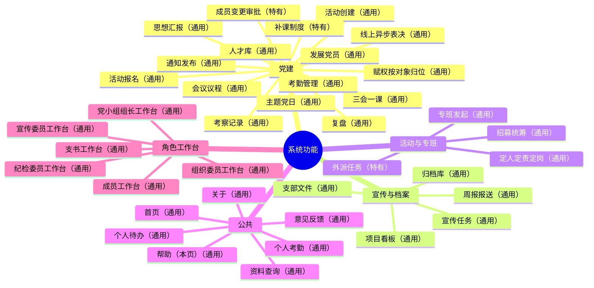

# GSM1921-SOP

制度即代码的组织运行系统引擎——把制度文本从"写在文档里没人看"变成"嵌入系统中必须遵守"：日常运行有章可循、有据可查、换届不散。

> **后端对接方请看这里 → [README-server.md](README-server.md)**（对接说明主文档：系统背景 + 后端全部**角色 / 功能 / 板块 / 字段**说明 + 部署步骤，每项都在）

> 本系统最初以**光华管理学院本科生党支部**的工作流为基础打磨；随持续迭代逐步通用化——现面向各类党支部与学生组织 / 师生组织，**任何组织都可以部署属于自己的一份**（自有名称、成员与账号、制度文本、角色分工、主题配色与后端数据），彼此独立、互不影响。
>
> 仓库随附的**示例组织**（即最初打磨所用的本科生党支部示例数据）仅用于开箱即跑与完整演示，是可整体替换的默认值，不代表本系统的适用范围。

- **后端对接说明书（面向外部后端对接团队）**：[README-server.md](README-server.md)
- **组织内部使用 · 使用者视角**：[README-members.md](README-members.md)
- **后端服务说明**：[server/README.md](server/README.md)

MIT · Node ≥ 22 · 原生 ESM（无打包器/无构建步骤）· 纯本地数据可离线 · 可选 Node 一体化后端

---

<!--FUNC-MAP:ANCHOR-->

## 功能地图

> 通用能力与组织特有能力以（通用）/（特有）文本标注区分；本块三章（能力地图 / 关键业务链路表 / 完整四章指针）由 `node docs/scripts/gen-function-mermaid.mjs --write` 从 docs/src/core/domain/function-catalog.js 与 mermaid-sources.js 生成，勿手改（完整四章含逐条 flowchart 用同脚本 stdout 打印）。

<!--FUNC-MAP:START-->

### 一、能力地图（按制度域）

> **读法**：本图按**制度域**分组（党建 / 宣传与档案 / 活动与专班 / 公共 / 角色工作台），与「角色工作台」不互斥——同一能力可能由多台承载，故「党建」组里既有页面也有职能。


```mermaid
mindmap
  root((系统功能))
    党建
      活动创建（通用）
      会议议程（通用）
      三会一课（通用）
      主题党日（通用）
      活动报名（通用）
      赋权按对象归位（通用）
      通知发布（通用）
      线上异步表决（通用）
      发展党员（通用）
      人才库（通用）
      考察记录（通用）
      考勤管理（通用）
      补课制度（特有）
      复盘（通用）
      思想汇报（通用）
      成员变更审批（特有）
    宣传与档案
      宣传任务（通用）
      项目看板（通用）
      周报报送（通用）
      支部文件（通用）
      归档库（通用）
    活动与专班
      专班发起（通用）
      招募统筹（通用）
      定人定责定岗（通用）
      外派任务（特有）
    公共
      首页（通用）
      资料查询（通用）
      意见反馈（通用）
      个人待办（通用）
      个人考勤（通用）
      帮助（本页）（通用）
      关于（通用）
    角色工作台
      支书工作台（通用）
      组织委员工作台（通用）
      宣传委员工作台（通用）
      纪检委员工作台（通用）
      党小组组长工作台（通用）
      成员工作台（通用）
```

### 二、关键业务链路（12 条）

> 本表**从单一源派生**（勿手改）：链路名与顺序取 `docs/src/core/domain/function-catalog.js` 的 flow 条目，起 / 终取 `docs/src/core/domain/mermaid-sources.js` 的 `FLOW_LINKS` 首 / 末节点，「经」＝该链路箭头步数。逐条 flowchart 见第三章。

| 链路 | 起 | 经 | 终 |
|------|----|----|----|
| 支委会链路 | 支书 · 确定议题并提前通知 | 4 步 | 纪检委员 · 跟进请假缺勤补课 |
| 线上支委会链路 | 支书 · 创建线上支委会并定稿议程 | 3 步 | 支书 · 记录会议决议 |
| 党小组会链路 | 党小组组长 · 统筹时间·确定主题·提前通知 | 6 步 | 宣传委员 · 归档党小组会记录 |
| 党课链路 | 支书 · 发布党课通知与学习材料 | 1 步 | 支书 · 提醒缺席党员补课 |
| 主题党日链路 | 组织者 · 策划并发起活动 | 7 步 | 宣传委员 · 归档宣传与活动材料 |
| 支部党员大会链路 | 党小组组长 · 统筹时间·确定会议主题 | 6 步 | 宣传委员 · 推文与工作记录归档 |
| 专班链路 | 支书/组长/委员 · 发起专班 | 3 步 | 专班成员 · 执行分工并记录贡献 |
| 发展党员链路 | 支委会 · 讨论推荐为发展对象 | 4 步 | 支书 · 确认并更新发展阶段 |
| 考察积极分子链路 | 党小组组长 · 日常观察（态度与能力） | 4 步 | 支委会/支部党员大会 · 讨论是否发展 |
| 制度制定与迭代链路 | 条条委员 · 起草制度初稿 | 6 步 | 条条委员 · 监督落实与适时修订 |
| 补课回写链路 | 纪检委员 · 记录缺勤 | 3 步 | 纪检委员 · 考勤回写 / 逾期清除 |
| 思想汇报链路 | 党员 · 提交思想汇报 | 2 步 | 组织委员 · 查看与调用 |

### 三、完整四章（架构分层 · 服务依赖 · 数据流）

> 完整四章（功能地图 · 12 条业务链路 flowchart · 架构分层 · 服务依赖）**不落盘**（免 README 臃肿）：运行 `node docs/scripts/gen-function-mermaid.mjs` 打印到 stdout 查看。

<!--FUNC-MAP:END-->

## 一、你的部署（每个组织自己的实例）

- **你看到的公网演示**（<https://czhgo.github.io/GSM1921-SOP/>）只是**示例组织的一个部署**，用于试用体验——不是本系统的唯一形态。
- **每个组织部署自己的实例**：组织名称、成员与账号、制度文本、分工与权限、术语、主题配色、后端数据各自独立；同一套引擎可被多个组织分别部署，互不干扰。
- **三步走**：clone（或直接用 `node deploy/package.mjs` 打好的发布包）→ 替换数据与配置（入口见 [四、复用与二次开发](#四复用与二次开发给其他组织) 的「替换入口总表」）→ 部署到自己的机器（**一键 `deploy/install.sh` / `install.ps1`**；装完跑 `node deploy/doctor.mjs` 自检并告诉你还差什么；详见 [server/README.md](server/README.md) 与包内自动生成的 `DEPLOY.md`）。**首启空库会自动建立组织基线：党委账号 1 名 ＋ 支部「光华管理学院本科生党支部」，不带任何成员名单**。
- **不替换也能先跑**：保持示例数据即可完整演示；正式投入前建议先执行 `?reset=init`（保留组织骨架——账号 / 成员档案 / 支部配置 / 分工 / 术语 / 主题，清空业务过程数据），再从零录入本组织数据。

---

## 二、这是什么

三个核心设计：

1. **制度即代码** —— 制度文本（`content/02_institution/sop/`）是唯一母本，改一处制度，全系统同步
2. **角色即视图** —— 同一数据源按角色投影：谁能看到谁由权限链计算，看 ≠ 做，每个角色只看到自己该看的事
3. **经验可传承** —— 决策、执行、复盘全程留痕（`.ctx/` 过程记录），换届不必"从零开始"

上述设计不含任何特定组织的前提——示例组织（本科生党支部）的人员数据、制度文本与主题配置**只是可替换的默认值**，任何组织换上自己的数据与制度即可运行。完整功能地图（mermaid）见本文顶部「功能地图」；逐项使用说明见 [README-members.md](README-members.md)。

---

## 三、功能说明

### 3.1 页面构成（台级）

| 类型 | 页面 | 用途 |
|------|------|------|
| 根页 | [index.html](docs/index.html) / [login.html](docs/login.html) | 首页 / 登录（登录直达对应角色工作台「今天」页） |
| | search / feedback / archive | 资料查询（含支部文件） / 意见反馈 / 归档库 |
| | activity / taskforce / notice | 活动与会议详情 / 专班详情 / 通知 |
| | [party-committee-meeting.html](docs/party-committee-meeting.html) | 支委会会议页（选线上召开 → 提取议程 → 委员线上表态 → 汇总截止 → 留存并查阅讨论结果；仅支委可进） |
| | thought-report / person | 思想汇报长文阅读 / 成员档案 |
| | wizard / help / about / settings | 支部配置分步向导 / 帮助手册 / 关于 / 设置中心 |
| 工作台 | [secretary.html](docs/workspace/secretary.html) | 支书工作台（支书 / 副支书**共台**） |
| | org / prop / disc | 组织 / 宣传 / 纪检委员工作台 |
| | leader / visitor | 党小组组长 / 成员工作台 |
| | [party-committee.html](docs/workspace/party-committee.html) | **党委工作台**（组织级：监控全院支部、管理支部实例，不参与支部内部事务；**但对匿名事项保留核查权**——可查反馈的真实提交人，**每次查看留痕**） |

全站共 22 个静态页（15 个根页 + 7 个工作台）：**逐枚页面**的用途与登录门控见 [README-server.md](README-server.md) §3.1，**各工作台逐枚页签**（共 73 个）见其 §3.2 与系统内【帮助】页第 0 / 2 章。

**设置中心**（settings.html，侧边栏右下角「设置」）按登录身份分区（左栏共 10 个分区）：**外观**人人可用（字号 / 明暗主题 / 强调色，全站即时生效；未登录访客偏好存本浏览器、登录后随账号）；**我的工作台**供登录用户调整本人页签顺序（仅本账号生效）；**支部治理**按角色发牌——支书 / 副支书管支部信息与换组织向导、工作台默认顺序、支部制度参数、**配置变更记录**（每次配置保存的留痕与单键回滚）（**副书同权**），纪检 / 组织 / 组长各管本域职责参数，党委组织员另有跨支部治理入口。**页签顺序个性化**：登录用户可在 设置→我的工作台 调整本人页签顺序（默认沿用支部默认顺序，核心固定页签不可动）；支书 / 副支书可在 设置→支部治理→工作台默认顺序 为全体成员设定默认顺序。**逐区一览**（有哪些区 / 每区管什么 / 你能看到哪几区）见【帮助】页 §4.1、使用者操作见 [README-members.md](README-members.md)。

### 3.2 工作台的通用结构

登录后直达对应工作台并落在「**今天**」页（置首 tab = 登录落点）；各支部角色工作台 tab 按「工作台 → 我的职责 → 知情查看 → 制度与答复」分组（党委台为院级例外，按「首页 → 全院治理 → 支部治理」分组）：

- **今天** — 只读速览（今天有会 / 今天到期 / 今日分工），全部点击 ≤1 跳直达处理处
- **待办** — 页顶「未读通知 N 条」轻量条 + **工作域折组**：会务、活动/项目、考勤纪律、考察、成员发展、专班、决议上报、归档宣传、汇报反馈等（实时提醒组并入对应域）；域内提供批量确认，如「成员发展」域批量勾选确认/退回成员变更（发展阶段/在册状态/移出）
- **工作概况** — 汇报 / 卡点 / 在办三区总览（支书台为「全局概况」，按维度/按人）
- **我的职责 tab 群** — 各角色职责域（见下）
- **我的处置** — 意见反馈 / 汇报的收件处理位（组长台为「组员进展」内待答复）

**表格与宽表（全站统一口径）**：

- **凡「人 × 项目」这类二元关系默认宽表**——同一份数据两个正交视图，互为**转置**：**按人**（第一列＝人，列＝他参加的活动/专班）与**按项目**（第一列＝项目，列＝参加的人）；切换只换视角，不是两张表。典型的「按人明细」长表（每人次一行）降为**「明细 / 导出」**下钻位，不再当主页。
- **项目维列封顶「最近 6 项」**（活动/专班逐年累积，列不能无限长），可一键「显示全部 N 项」；**人维分页：每页 10 人**（人多时翻页看更多人，`rowLimit: 0` 才不分页）；横向滚动时**首列吸附**，维度名不丢。
- **宽表已推广到「支部分工」（平铺模块 / 按人 / 按项目 三视图）、「专班报名总表」（人 × 专班）、「表态汇总」（议题 × 应到成员）、「思想汇报台账」（人 × 期次：行＝支部在册成员、列＝期次新→旧，格内＝该期最需处理的状态徽标，未提交显示「—」——谁哪期漏交一眼可见；**可按「按人 / 按期次」互转视角**）**——凡二元关系域一律复用同一矩阵，不再各造一套表格；各域「待迁清单」已清空。
- **筛选器与表格同一档字号/组件**（全站单档 **13px / 38px**）；筛选行只在结果多于 8 行时出现，空维度自动隐藏。
- **凡数据可能无限增长的列表一律分页**（每页 10 条，页码记住；不足一页不出翻页控件）；**翻页控件单一源 [components/ui/pager.js](docs/src/components/ui/pager.js)**（`pagerHtml`，统一检索引擎与宽表矩阵共用，各页不得自造第二套）。

### 3.3 支书工作台（支书 / 副支书共台）

覆盖面＝支部统筹的各条线：全局概况（按维度 / 按人）、活动管理（会务日历）与支委会会议（线上召开：提取议程 / 委员表态 / 汇总截止 / 留存讨论结果，线上与线下完全同等效力）、赋权管理与通知发布、上报党委（见 3.5）、支部分工（工作地图，平铺模块 / 按人 / 按项目三视图，缺省「按人」宽表）、反馈管理，以及只读的知情查看（活动 / 专班分段——知情权：无职责亦有知情权）。**党小组**清单与新增 / 改名 / 解散写权归支书与副支书，未分组行内归组；跨组切换只读掌握，组内待答复可「请组长关注」——支书不代组长答复。待办含「待答复」「专班待议」置顶入口。支部治理类操作（换组织向导 / 模块组合 / 工作台默认顺序等）收口于侧边栏右下角「设置 → 支部治理」（支书 / 副支书共台同权，见 3.1 设置中心说明）。本台逐枚页签见 [README-server.md](README-server.md) §3.2.1。

### 3.4 党委工作台（组织级）

组织级视图：登录落在治理总览（支部概览统计 + 近期动态），其下覆盖支部监控台账、上报审批（支部上报逐项批驳、结论回传支部）、支部管理（支部实例增改与任命）、下发通知（送达支部支委层，标「党委下发」）、支部配置（模块 / 分工 / 向导，属党委与部署期职责），并保留匿名反馈的真实提交人核查权（每次查看留痕）。本台逐枚页签见 [README-server.md](README-server.md) §3.2.7。

### 3.5 关键机制（可复用工作流 · 确认收尾）

- **三会一课 / 主题党日**：决策树向导创建（场景+形式逐层选择，自动生成后续任务链——**任务默认只写「标题+时限」骨架，制度详情按需展开**）→ 会议议程（可挂**讨论文件 / 待讨论名单**）→ 通知/报名/考勤 → 线上异步表决（**出席 >2/3 且无反对**通过，支委会从严口径；弃权允许、异议视同反对）→ 记录决议 → **决议自动督办**（决议「待落实」项勾选责任人/时限 → 责任人工作台自动派生跟进待办 → 逾期进支书台催办 → 支书销项收尾）
- **考勤**：上传位**按会议类型分**——支委会**不考勤**（规模小），党课 / 支部党员大会由**纪检委员**上传（支书 / 副支书亦有权上传），党小组会 / 组织生活会 / 主题党日由**该场组织者**上传；纪检管确认与统计核对、认定异常标因、滞留到场补录；考勤确认 → 三会一课/主题党日缺勤**自动生成补课任务** → **考勤统计报支委会**（组织委员接收建档；原「交宣传备案」去向已按 `D-429` / `D-474` 改准）
- **考察**：活动/专班考察上传（组织者）→ **纪检确认** → 组织建档（考察记录汇总入成员发展档案）
- **发展党员两级确认**：两种来源——名册报送（成员发展阶段/在册状态/移出由组织发起）与会议议程「待讨论名单」（**会上逐人记「通过/未通过」，未通过留痕**）→ **组织审批 → 支书确认**生效，双层留痕、可退回（退回名册报送须填意见），逐项或域内批量；通过者自动进入确认链（来源标「会议结果」），成员发展档案可溯「来源会议」。会议议程中的发展事项只选**目标**（转为预备党员 / 转为正式党员），当前阶段由系统按成员档案自动取；「积极分子 → 发展对象」这一步**须先经支委会讨论通过**才可发起阶段变更
- **思想汇报**：**提交即入库即归档**（算法按人归集至个人档案，不设人工归档门）；篇幅建议 1500 字以上，**少于 1200 字触发警告审阅、不影响提交**（**该提醒只给你本人看**，组织侧不留「篇幅不足」标记）；组织委员在「思想汇报」页查看调用（**台账宽表（人 × 期次）**，一眼看出谁哪期交了、有没有漏交，点格直达阅读页；必要时可在阅读页**打回要求本人补充**）
- **专班全生命周期**：发起（提出需求）→ 招募统筹 → 定人定责定岗 → 运行（活动/考察承接）→ 复盘 → 归档；发起与招募分离
- **上报党委双向通道**：支部关键事项（发展节点/活动报备）上报 → 党委逐项审批（通过/批驳）结论回传支部；党委侧另有下发通知通道
- **资料查询与支部文件版本化**：全站资料查询（search）；支部文件支持**上传新版=旧版归档可查**、现行/停用态、制度文本由支书 / 副支书（副书同权）新建，并支持**制度草案态**（草案 → 支委会审议 → 通过成现行版 / 未通过退回起草人修改；是否报送党员大会表决在审议时定）
- **品牌认定**：新品牌**由支委 / 党小组组长提案 → 支委会审议通过后确定**（系统里没有「点一下即认定」）；品牌字段适用任何活动；认定与意见建议处置均归支委会，系统上向支委层开放
- **数据交接**：支委间固定交接协议（纪检→组织 考勤统计 / 纪检→组织 考察记录提交 / 组织→纪检 补课需求回执），生成即自动为接收方派生待办、确认即销项，双向可追溯
- **支部配置分步向导**：组织信息 → 模块/块组合 → 角色分工 → 术语制度指引+工作单 → 验证与重置（含完成报告），草稿可续走；入口=wizard.html + 设置→支部治理（支书 / 副支书，副书同权）+ 党委台「支部管理 → 支部配置」（权限分轨）
- **数据一键重置三档**：`?reset=demo`（回演示种子）/ `?reset=preview`（只清运行时预览草稿）/ `?reset=init`（**一键初始化**：清空业务过程数据、保留组织骨架——账号/成员档案/支部配置/分工/术语/主题，空支部起步）

全站交互遵循支书倡导的 **closed-loop「确认闭环」表达文化**：动作必有回执与状态回读，不悬空（出处见 [DEVELOPMENT_PATH.md](content/01_strategy/DEVELOPMENT_PATH.md)）。

---

## 四、复用与二次开发（给其他组织）

> 核心价值在**可复用**：先跑起来 → 换数据 → 换角色/配色/术语 → 组合功能 → 深度二次开发。每一步都有正式入口——**替换默认值即换组织**，不必改动系统骨架。这也是本系统从单一组织工作流走向通用可复用的路径。

### 替换入口总表

| 要换什么 | 替换入口 |
|---------|---------|
| 组织数据（人员/活动/通知/专班/考勤/档案） | [docs/src/data/mock/](docs/src/data/mock/) 数据文件整体替换；服务端种子 [server/seed.js](server/seed.js) 复用同一份数据 |
| 角色与权限 | 角色清单单一事实源 [docs/src/core/domain/constants.js](docs/src/core/domain/constants.js)；权限矩阵 [content/02_institution/SYSTEM_ROLE_PERMISSION.md](content/02_institution/SYSTEM_ROLE_PERMISSION.md)；部署形态 [docs/src/config/deploy.js](docs/src/config/deploy.js) |
| 主题配色 | 色彩令牌 [docs/src/styles.css](docs/src/styles.css) + constants.js（禁改，须支书特批）；固定/可调口径见 [DESIGN_SYSTEM.md §二 色彩系统](content/04_web_design/design-system/DESIGN_SYSTEM.md) |
| 术语与制度 | 术语权威源 [OPERATIONS_GUIDE.md §19](content/03_doc_system/OPERATIONS_GUIDE.md)（《运行与协作规范》）；制度母本 [content/02_institution/](content/02_institution/) |
| 业务默认（阈值/名单） | [docs/src/core/domain/policy-defaults.js](docs/src/core/domain/policy-defaults.js)（`branch-default`=支部可调 / `institutional`=制度固定须支书裁决） |
| 功能模块组合 | 能力注册表 + 支部 config.modules/blocks 启停排序（模块声明契约 [docs/src/core/base/module-compose.js](docs/src/core/base/module-compose.js)） |
| 后端与部署 | [server/README.md](server/README.md)；数据源 adapter（本地 mock ↔ REST API）见 [docs/src/core/](docs/src/core/) |

**30 分钟换壳**：clone 并 `cd server && npm install && npm start` → 换 `docs/src/data/mock/`（人员/账号/活动/考勤/专班等，[accounts.js](docs/src/data/mock/accounts.js) 账号可登录）→ 换角色/权限/术语/配色/policy-defaults → 换支部名与分支配置（[branches.js](docs/src/data/mock/branches.js) 或向导可视化配置）→ `cd server && npm test` 验证（应到口径派生自 policy-defaults，替换数据后按需改 `partyStages/excludeDetained`）。组织内部逐项替换示例见 [README-members.md 九](README-members.md#九复用与二次开发给其他组织)。

---

## 五、快速开始

**公网演示**：打开 <https://czhgo.github.io/GSM1921-SOP/>，用演示账号（[accounts.js](docs/src/data/mock/accounts.js)，密码 `123456`）登录。该地址是**示例组织的一个部署**，仅用于试用。

> 演示数据可随时恢复初始态：地址后加 `?reset=demo`（回种子初始态）；`?reset=preview` 只清运行时预览/草稿（如向导草稿 `wizard-draft-*`、成员基础数据预览）不动演示本体；正式投入使用前用 `?reset=init` 一键初始化为「新支部初始态」——清业务过程数据（活动/考勤/考察/专班/通知/汇报/议程决议跟进/归档/交接/意见反馈等），**保留组织骨架**（账号与角色结构、成员档案、支部配置/分工/术语、在册状态与主题外观）。登录后端（API 模式）后三档均不生效——数据以服务器为权威，不清登录会话与远端数据；API 模式的「重置/初始化」= 删除 `server/data.db` 重启自动重种，或 `DISABLE_SEED=1` 空库起步。

**本地完整运行**（账号登录 + 数据持久化，需 Node ≥ 22）：

```bash
git clone https://github.com/czhgo/GSM1921-SOP.git
cd server
npm install
npm start
```

访问 `http://127.0.0.1:3000/login.html`。环境变量模板见 [server/.env.example](server/.env.example)；安装/启动/测试/部署对接详见 [server/README.md](server/README.md)。

> ⚠ **为什么在浏览器里「只看到 HTML 文档、不是网页」**：本系统是原生 ESM 模块应用——页面必须**经 HTTP 服务**提供，浏览器才会把它当网页（加载 `<script type="module">`、发起 `/api/v1` 请求）。若用 `file://` 打开（双击 `docs/index.html`，或在编辑器里预览该文件），浏览器只按「文档」渲染：模块被跨源策略拦下、接口无从发起 ⇒ 看到的就只是一份 HTML 文本。**正确入口＝从服务访问**：`http://127.0.0.1:3000/login.html`（`npm start` 后），或把 `docs/` 交给任意静态服务器（如 `npx serve docs`）。路径不要用 `file:///...`。
>
> ⚠ **只读演示**：**没有 API 会话时**（静态托管 / 未登录 / 本机演示），系统按**只读演示**运行——可浏览、可点开，一切写操作会提示「当前为只读演示：数据不会保存到本机，请登录后使用服务器数据」，**不再把数据存在浏览器本地**（避免「以为存上了、登录后被服务端数据覆盖」）。登录（[accounts.js](docs/src/data/mock/accounts.js) 演示账号，密码 `123456`）后即切到服务器数据形态。本地开发需临时放行本机可写时，置环境变量 `DEMO_READONLY=0` 启动（仅本地/测试用）。

---

## 六、开发路径

### 技术形态

原生 **ESM 模块**、**无打包器 / 无构建步骤**（浏览器直接加载 `docs/src/*.js`）；前端静态（`docs/`）+ 后端可选（`server/`，Express + better-sqlite3 单进程，同源托管页面与 `/api/v1` REST，全部持久化域前后端对称，以对账清单为准）。

### 目录结构

```
docs/src/
  core/       内核（**2026-09-29 批次 267 分四子域**）
              base/（零依赖基础件：id/utils/icons/period/state/version-token/module-compose）
              domain/（领域口径与单一源清单：constants/domain/policy-defaults/work-map/function-catalog/mermaid-sources/system-notice-templates）
              boot/（启动装配与页面骨架：bootstrap/registry/tab-nav/theme）
              session/（会话级 / 跨页轻量状态：cross-page-state/pending-target/pending-writes/login-snapshot）
  data/       数据形态层（**2026-09-29 批次 267 新立**）：data-adapter（门面）· api-adapter · mock-adapter（禁改）· data-loader
              mock/（演示数据 15 件；整体替换即换组织）
  services/   数据 CRUD 与权限计算（UI 层禁止直改数据源）；**按域分子目录**
              core/（底座与横切）· member/（人与名册）· activity/（活动与会务）
              governance/（治理与反馈）· branch/（支部组织与配置）
  components/ 视图组件；**按性质 / 角色分子目录**
              ui/（基础件与库里：badges/forms/modal/pager/list-filter/relation-matrix…）
              shell/（页面外壳）· sections/（页级板块：help-catalog/references；批次 267 新立）
              feedback/（反馈域）· record/（实体视图）· governance/（治理与人员面板）· dashboard/（首页面板）
  capabilities/  能力声明（**2026-09-29 批次 267 由 `modules/capabilities/` 上提为顶层**；12 件）
              —— 与 `entries/` 对称：入口薄壳 ↔ 能力声明（每台一张 tab 清单）
  entries/    页面入口；**按判据分三类**——pages/（独立页入口 15 个）· workspace/（角色工作台薄壳入口 7 个）
              · tabs/{各台 tab}（早已按台分组；today 共享「今天」渲染）
  workflow/   工作流引擎（engine/renderer/sop/sopData + blocks/ 块契约与编排内核）
  config/     部署配置（deploy.js）
content/      分层权威源：01_strategy（支书战略与批改）/ 02_institution（制度母本）
              / 03_doc_system（文档治理）/ 04_web_design（设计档案）/ 05_ai_coding（协作方法论）/ insights（经验沉淀）
.ctx/         过程记录：logs（执行/决策日志）、REVIEW_QUEUE、SNAPSHOT、TIMESTAMPS、ENGINEERING_ASSESSMENT（工程化评估与改造行动线）
server/       可选后端 + 测试套件（server/test）
```

**单一源组件（新增件在此登记，防各处另写一版）**：`components/ui/list-filter.js`（统一检索引擎：关键词 + 分面 + 计数 + **分页**，全站按人/按活动表共用；既无关键词也无分面时不渲染检索条，供「只需分页」的桶/分组子列表复用）、`components/ui/pager.js`（**翻页标记单一源** `pagerHtml`：自 list-filter 下沉为叶子件，统一检索引擎与宽表矩阵共用，页数 ≤1 不出控件）、`components/ui/relation-matrix.js`（**人 × 项目矩阵**：按人 / 按项目互为转置、项目维列上限 6 + 一键展开、**人维分页每页 10 人**（`rowLimit` 可配，0＝不分页）、`cellClass` 单元格附加类钩子、横向滚动 + 首列吸附）、`components/record/insight-view.js`（**知情查看单一源**：活动 / 专班只读分段，纪检 / 组长 / 组织 / 宣传 / 成员 / 支书台复用）、`components/governance/pickers.js`（**选人域唯一出口**：选人载体 PersonPicker + 成员档案编辑浮窗 openPersonEditModal；其两个实现文件不得被直连，一律经本库——§3.1 扎口纪律，守卫见 person-consistency 的 S5）、`services/member/party-group.js`（党小组活组清单 `groupOptions()`）、`services/member/member-flow.js`（成员流动登记与复式记账对账）、`docs/scripts/version-next.mjs`（版本号推导纯函数）。

content/ 文档是**支书批改的权威源**（制度先改文本、后同步代码）；.ctx/ 是逐次工作的审计底座（执行日志记「做了什么/改了哪些文件」，决策日志记「为什么选 A 不选 B」）。

### 测试

`cd server && npm test` —— **node:test** 套件（`node --test`，纯 node 部分沙箱可跑；浏览器类/E2E（Playwright，锁定 1.60.0）需常规终端）。**测试按工作台分片**（`server/test/sweep-shard.mjs` 单源 · 启动器 `server/run-suite.mjs`）：`npm test` 默认只跑**一片**（**单片墙钟 ≤10 分钟**；非 e2e 文件每片全跑，e2e 按片切分，**四片并集 ≡ 全量**——由 `suite-shard.test.mjs` 钉死），`$env:SWEEP_SHARD=<1|2|3|4>` 选片（**改到某台/某线必须选覆盖它的片**），`npm run test:full` 跑**全量**（发布前 / 大批改动）。重点文件集（随功能演进持续增长）：

- 待办/今天域：`todo-domain.test.mjs` / `todo-deriver-domain.test.mjs` / `todo-domain-view.test.mjs` / `today-summary.test.mjs`
- 性能守卫：`perf-render-guard.test.mjs` / `perf-todo-agg-cache.test.mjs` / `perf-version-token.test.mjs` / `perf-index-equivalence.test.mjs`
- 成员确认/报送：`member-confirmation.test.mjs` / `reset-tier.test.mjs` / `reset-tier-init.test.mjs` / `thought-review.test.mjs` / `roster.test.mjs` / `roster-ui-logic.test.mjs` / `group-view.test.mjs`
- 治理/审计：`resolution-followup.test.mjs` / `workforce-gate.test.mjs` / `link-integrity.test.mjs`（死链与页面定位）/ `catalog-sync.test.mjs`（**清单类口径同步**：功能目录结构 T1 · 链路键集 T2 · 功能地图 T3 · 表决枚举 T4 · 官方制度链接 T5——批次 47-F 由五个细碎文件合并）
- **真机普查 / 同类病灶规模守卫**：`page-sweep.test.mjs`（**七台 × 全部 tab 真机普查**：分页 · 宽表人维（含**转置视图**——人维落在列上时按同一页切片口径断言）· 手写表格 · 检索 · 零脚本错误 ＋ **真机尺规**（控件 38px / 数据格 13px / 裸控件 / 分页钮 30px 例外；规则编号见文件头（**非断言名**））＋ **二级视图审次**（矩阵「显示全部 N 项」展开态、视图切换钮——原只审默认视图）＋ **自建列表分页**（卡片 / 行块 ≥ 12 同构块须有翻页；**原 2 处已确认不合规的载体（档案归档 22 块 / 组员进展卡点 13 块）已于批次 47-H 全部接统一检索引擎闭环、待修台账随之清空 `Q-23-40`**，台账僵尸化同样红灯）；**S0** 门槛取单一源、**S1** 分页非空转、**S2** 环境自检（静音的外部资源须逐条登记理由——真机 ≠ 真环境）、**S3** 尺规非空转）· `form-loop-sweep.test.mjs`（**S0–S6** 台账守卫 + **60 条真机闭环**：空必填点提交须报**可见**提示，且**提示点名的字段必须有可见载体**；另 **17 条真机成功路径**：填对→触发须有**成功提示** + **当场真生效** + **整页重载后仍成立**（＝落库；详情面板类写口用 `reopen[]` 重开后断言），每条流程另施加「**未捕获脚本错误**」判据；台账 `form-loop-registry.mjs` 共 **118** 处校验点（`SITES_BASELINE`）、其中 `machine:true` **103** 条可自动化、`machine:false` **15** 条非自动化逐条写明 reason；台账另有真机流程 **60** 条（`FLOWS_BASELINE`）。**S6（批次 49）＝台账行号未同步即红灯**：声明的 `line` 必须精确落在该文案那一行——`S4` 只核「文件在 + 文案在文件里」，行号是台账里唯一没人核的那一半，实做时查出 93 条里 11 条已经对不上）· `validation-site-coverage.test.mjs`（**`R-73` 第 ③ 缺的守卫**：`V1` **漏登记增量检测**——按台账开篇同一套「登记判据」扫 `docs/src/**`，把「未登进 `VALIDATION_SITES` 的字段级必填校验点」压进**只降不升**的存量基线；**本守卫落成当天即揪出 5 处真漏登记**〔议题「事项领域」· 组长驳回申诉 · 成员考勤申诉 · 成员考察申诉 ×2〕⇒ 已同批登记，台账 103 → 108。⚠ 只认**字面量文案**形态：经变量拼接的报文扫不出，那一半仍靠人读）
- 口径 / 单一源 / 说明文件守卫（**凡 `DATA_CONSISTENCY_CHECKLIST.md §0.2` 索引引用的守卫都必须登记在本清单**，由 `doc-consistency.test.mjs::S10` 常驻断言——守卫存在却没人看得见＝半个没做，批 43 的 `page-sweep` 即长期缺席）：`filter-row.test.mjs`（S1–S13 + D1–D3）/ `relation-matrix.test.mjs`（S1–S6）/ `party-group.test.mjs`（S1–S4 + D1–D6）/ `version-stamp.test.mjs`（S1–S7 + D1–D11）/ `doc-consistency.test.mjs`（S1–S16；**S13 规模判据＝推导式恒等式**——已比对 ＋ 各档已跳过 ＝ 登记总数，取代旧的手改字面量；**S16 守卫注册完整性**——S 类测试文件须全数列入 `test:daily`，防守卫孤儿化）/ `frontmatter-freshness.test.mjs`（**`R-83` 机检**：`F1` git-free（登记行备注日期 > 表行日期即红）· `F2` git（`last_updated` 早于最后提交日、或干净却写超前日期即红；无 git 只报不判）· `F3` 非空转正负例——「改了没刷卡」不再靠人记）/ `ux-guard.test.mjs` / `inspection-loop-e2e.test.mjs` / `member-flow.test.mjs` / `member-persist.test.mjs` / `permission-gate.test.mjs` / `person-consistency.test.mjs` / `id-uniqueness.test.mjs` / `notice-audience.test.mjs` / `issue-branch.test.mjs` / `module-load.test.mjs`（`E1`–`E4`；`E4`＝真机装配断言） / `click-cost.test.mjs` / `mock-integrity.test.mjs` / `member-progress.test.mjs`（**服务端汇总**：单一源结构断言 + 双态同源 + 四项非空转）/ `pending-writes.test.mjs`（**「成功提示＝落库已确认」**：W1–W4 行为层（落地 / 失败必抛且只报一次 / 长链期间新登记也等到 / 不产生 unhandledrejection）+ W5–W9 结构层（success 必先经 `settleWrites`、Toast 渲染单一源、`persist` 与**快照排程**都须登记、flush 失败须结算并上抛、外部写链须登记且 `saveDB` 不得再用动态 import——批次 49 立） / `issue-anonymity.test.mjs`（**匿名反馈的出口脱敏与写口纪律**：常态出口（公开读 / 支书读 / 提交与处置回执 / 前端各出口）一律不含真身，而支书反复处置（PATCH）之后库里仍须保留真身——「处置不清真身」） / `doc-line-ref.test.mjs`（**说明文件的取证断言**（批次 107）：`README-server.md` 里 **≥370 处 `文件:行号` 引用**（下限＝`doc-line-ref::R5` 基线，**不写死精确数**——写死必陈旧，见 `CLAUDE.md R-91`；本批实测 407 处）逐条核 **R1** 指针指向真实位置（文件可解析 / 行号在范围内 / 区间非空——含**短式** `:192` 与**逗号续列** `:44,161`）· **R2** 引用后括注里的符号（如 （`ROLE_KEYS`））必须出现在**声明区间内** · **R3** md 区间不得越到下一节（末个非空行不是标题 / 起点是标题时区间内无同级标题）· **R4** 「零命中 / 检索不到消费点」类**关键词型取证**仍成立 · **R5** 非空转基线。⚠ 边界：**「换一种说法」的旧口径机检不了**（grep 只覆盖字面层），该半落 `CLAUDE.md R-87` 纪律） / `hex-hardcode-guard.test.mjs`（**硬编码 hex 存量回归**：H1–H5——新增即红 · 逐文件处数 ratchet · 非空转 · 缩减进度 · 搬移例外台账；基线 `server/test/style-baseline.mjs`）/ `control-font-guard.test.mjs`（**控件小字存量回归**：T1–T4——控件挂 `text-[11px]/[10px]/[9px]` 即红，`DESIGN_SYSTEM.md §4.3` 控件字号单档 13px）/ `link-target-guard.test.mjs`（**JS 渲染型 href 的裸文件名**：L6–L7——工作台页 `<base href="../">` 下裸 `x.html` 解析到站点根 ⇒ 404，须按 `<base>` 规则核目标真实存在） / `dead-selector-guard.test.mjs`（**零引用 CSS 类**存量回归：新增死类即红 · 台账 ＋ 动态白名单） / `text-tier-guard.test.mjs`（**段落档位**：`<p>` 挂 9/10px 即红、11px〔Overline 标签档〕基线之外新增即红） / `import-path-guard.test.mjs`（**`G1`–`G3`——相对 ESM 规格符的路径必须存在**：`from '…'` / `import('…')` 的**字面量**查文件、**模板字面量动态 import** 查**静态前缀目录**；补 `module-load::E1`（其 `collectJsFiles` 明写**跳过 `entries/`**）与 `link-integrity::L2`（自述**排除 ESM 规格符**）双双绕开的那一格。**由来＝批次 262 定根因的真事**：P5 目录分层把 `entries/*.js` 移进 `entries/pages/` 后**漏改一处模板字面量动态 import 的路径深度**（少一个 `../`）⇒ 运行时 **404**、「设置 → 我的工作台」面板恒显「加载失败」——**这就是 `preferences.test.mjs::真实拖拽` 长期红的根因**） / `copy-master-guard.test.mjs`（`N1`–`N4`——**界面复述制度母本**：与制度母本「连续 ≥20 字重合」即红，须改写成一行 ＋ `help.html` 深链） / `copy-length-guard.test.mjs`（`L1`–`L6`——**界面文案长度存量**：卡片导语 ≤60 字 · 单段 ≤80 字 · 单句括注 ≤2 个 · 空态 ≤30 字） / `copy-screen-guard.test.mjs`（`M1`–`M4`——**同屏复述 · 每屏「文案 ÷ 控件」**：真机 7 台 × 默认视图） / `copy-fold-guard.test.mjs`（`F1`/`F2`——**折叠区口径是否有 help 同义段**：机器判不了「同义」⇒ **只报不判**） / `copy-anchor-guard-e2e.test.mjs`（`A1`–`A3`——**口径定点锚点真机可达 / 可检索**） / `mock-api-parity.test.mjs`（`S0` / `P1`–`P3`——**mock 与 api 两形态读数一致 ＋ 服务端真按同源播种**；承重臂＝服务端 HTTP 原始行，防 `SEED_FALLBACK` 假绿） / `db-migration.test.mjs`（`M1`–`M6`——**版本化迁移**：新建库 / 幂等 / 既有库兼容 / 失败回滚 / 失败不吞） / `backup-restore.test.mjs`（`B1`——**备份 → 破坏 → 恢复演练**；反证「只 `copy` 丢 WAL 尾」） / `db-integrity-guard.test.mjs`（`G1`–`G6`——**完整性 / 版本自检 ＋ 新增结构须写 migration**） / `localstorage-key-guard.test.mjs`（`L1`–`L3`——**浏览器存储键必须登记**：三档白名单，`DATA_CONSISTENCY_CHECKLIST.md §0.3` 是其镜像） / `timestamps-note-guard.test.mjs`（`N1`–`N7`——**台账备注列预算**（`CLAUDE.md R-89`）：总量预算 ＋ 冻结高水位（**只降不升**）· 单格硬顶 1000 字 · 禁 `T-` 编号 · 禁日期复述 · 单格「批次 N」> 3 次；四份存量清单与命中集**双向相等**——新增即红、收敛未撤条目亦红） / `policy-config.test.mjs`（`R1`–`R3`——**每个 policy 参数恰属「可覆盖白名单」或「不可覆盖固定台账」两类之一**（`POLICY_FIXED`：kind ＋ why ＋ src），**无「未登记」第三态**；`R2` 禁 institutional 混入白名单 · `R3` 恒等式非空转） / `block-orchestration.test.mjs`（`O1`–`O5`——**工作流块编排内核**（`WORKFLOW_BLOCK_CONTRACT` L3/L4）：`O1` 用**反例**锁住「组合体检不是恒真」〔批次 239 修的真缺陷：`module-compose.js` 原只认 `it.id`、而块清单键名是 `blockId` ⇒ 过滤成空集 ⇒ 体检恒真〕· `O2` 端到端编排 · `O3` 错误累积不抛 · `O4` 拓扑序只前移被依赖者 · `O5` 编译产物是**既有 definition 形状的纯数据**）

- 测试机制守卫：`suite-shard.test.mjs`（`G1`–`G4`——**分片池并集 ≡ 磁盘全部 e2e 文件**（双向）· 片内文件存在且确为 e2e · 无重叠 · `SHARD_PAGES` 取值域 ≡ 真机 `flow.page` 出现过的页名；**新增 e2e 未归片即红**）

子集回归：`npm run test:core` / `npm run test:fast`（清单见 [server/package.json](server/package.json)）。

### ?v= 版本串收口纪律

浏览器缓存防分裂：改动前端文件后必须全链 bump 版本戳——`node docs/scripts/bump-version.mjs` 一键同步全站 `?v=`（含 `server/test/*.mjs` 内戳与 CODE_VERSION），**改文件即 bump 全链**；禁改文件仅随全站 stamp 动 `?v=` 查询串（零代码改动）。bump 后跑一次全量测试。

### 发版（语义化 release）

`CHANGELOG.md`（[Keep a Changelog](https://keepachangelog.com/zh-CN/1.1.0/) 体例）＋ `docs/scripts/release.mjs` 一条命令：**默认预演**，`--apply` 才落版（写 CHANGELOG 版本段 → 同步 `server/package.json` 的 `version` → 打 `vX.Y.Z` annotated tag，**不 push**）。版本号按变更类别**语义化升号**（`Added`→次版本 · 仅 `Fixed`/`Changed`/`Removed`→修订 · 含 `BREAKING`→主版本）；推导与 CHANGELOG 解析的单一源 = `docs/scripts/version-next.mjs`，常驻守卫 = `server/test/version-stamp.test.mjs::S7`（真 spawn 预演并独立复算版本号逐字比对）。发版三步见 [CONTRIBUTING.md](CONTRIBUTING.md) 第六节。

### 运行方式

- **纯静态**：任意静态服务把 `docs/` 当根目录（演示卡/账号登录走本地 mock，数据存浏览器本地）
- **账号登录/持久化**：`cd server && npm start`（页面与 API 同源，前端数据层一个常量切换形态，UI 零改动）

### 部署定位

当前定位为**本地 / 内网试用**（支书 C1 定位，2026-09-08），随附 GitHub Pages 公网演示。落地取舍：数据形态分**演示档**（浏览器本地 + `?reset=demo/preview/init` 三档重置）与 **API 形态**（服务器 SQLite 权威、`?reset=` 不执行、重置=重建 DB），按试用阶段选择。

### 开发纪律

- **禁改清单**：`content/`（支书批改层）、`docs/src/styles.css`、`docs/src/data/mock-adapter.js`、`inspector.js`、`roster.js`、`work-overview.js`、`secretary/overview-tab.js` 等须**支书特批**才内改（读链可只读复用其导出）
- **测试节奏（2026-09-15 支书定；2026-10-03 按「控制到 10 分钟以内」加分片）**：**日常只跑与改动面相关的定向守卫**（如 `node --test test/filter-row.test.mjs test/relation-matrix.test.mjs`，秒级到分钟级）或整档 `npm run test:daily`（约 2.4 分钟）；**收尾 / 提交前**跑**覆盖本批改动面的那一片**（`$env:SWEEP_SHARD=<k>; npm test`，**≤10 分钟**）；**发布前 / 大批改动**跑 `npm run test:full`（全量，真机普查 `page-sweep` / `form-loop` 耗时最长，受机器负载影响可到数十分钟——本机若开着大量浏览器进程会致 e2e 超时，须以「单独复跑」取证区分「环境负载」与「回归」）
- **提交节奏（2026-09-15 支书定）**：**小步提交**——每完成一个可独立验证的小步即提交（守卫绿 → 提交 → 再下一步），不积压；**AI 侧不能写 `.git`（沙箱权限），提交命令由 AI 给出、支书本机执行**；每批交付报告**第一屏**须给「提交命令 + HEAD 哈希 + 未提交规模」（未提交＝支书看不见＝等于没做，见 `CLAUDE.md` R-66）
- **push 须支书批准**（分支 ahead 待批时不得自行推送）
- **README 功能说明随功能同步**：功能/页面/机制变更须同步本文档与 [README-members.md](README-members.md)；**功能地图位于本文顶部**（`<!--FUNC-MAP:ANCHOR-->` 锚点后的标记块），由 `node docs/scripts/gen-function-mermaid.mjs --write` 从 [function-catalog.js](docs/src/core/domain/function-catalog.js) 生成，勿手改
- 更多工程纪律见 [CONTRIBUTING.md](CONTRIBUTING.md)、[CLAUDE.md](CLAUDE.md)（AI 协作治理）、[TEST_AND_VERIFICATION.md](content/05_ai_coding/TEST_AND_VERIFICATION.md)

---

## License

This project is licensed under the [MIT License](LICENSE).

参与开发请先读 [CONTRIBUTING.md](CONTRIBUTING.md)（工程纪律与提交约定）。

---

## 支部成员版章节索引

> 示例组织视角的详细说明（角色分工、阅读路径、内部制度细节、通俗版使用要点）在 [README-members.md](README-members.md)。以下标题为兼容既有文档指向本页历史章节的锚点链接而保留，正文以成员版为准。

### 一、这是什么？ → [README-members.md#一这是什么](README-members.md#一这是什么)
### 二、怎么开始用？ → [README-members.md#二怎么开始用](README-members.md#二怎么开始用)
### 三、我能用它做什么？ → [README-members.md#三我能用它做什么](README-members.md#三我能用它做什么)
### 四、我该看什么？ → [README-members.md#四我该看什么](README-members.md#四我该看什么)
### 五、出问题怎么办？ → [README-members.md#五出问题怎么办](README-members.md#五出问题怎么办)
### 六、设计理念 → [README-members.md#六设计理念](README-members.md#六设计理念)
### 七、系统架构与部署 → [README-members.md#七系统架构与部署](README-members.md#七系统架构与部署)
### 八、迭代路线图 → [README-members.md#八迭代路线图](README-members.md#八迭代路线图)
### 九、复用与二次开发（给其他组织） → [README-members.md#九复用与二次开发给其他组织](README-members.md#九复用与二次开发给其他组织)
