# 系统功能地图与服务逻辑（FUNCTION_MAP）

> 本文件由 `node docs/scripts/gen-function-mermaid.mjs --write` 自动生成，勿手改；功能清单以 `docs/src/core/function-catalog.js` 为准。

## 功能地图

通用能力与支部特有以下方（通用）/（特有）文本标注区分。

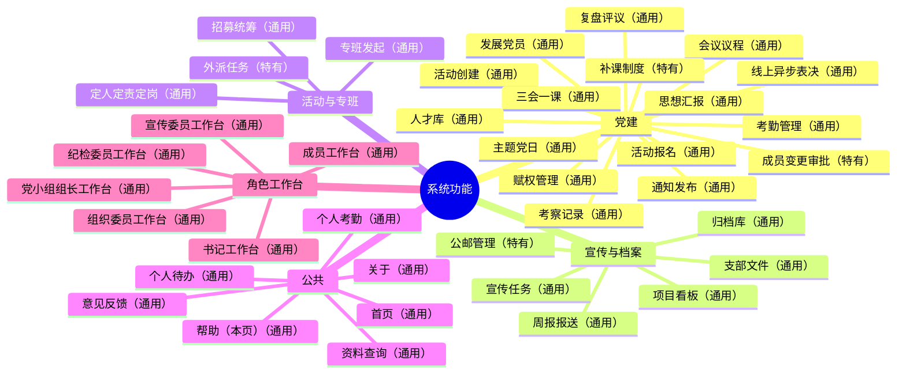

## 业务链路

### 支委会链路（通用）

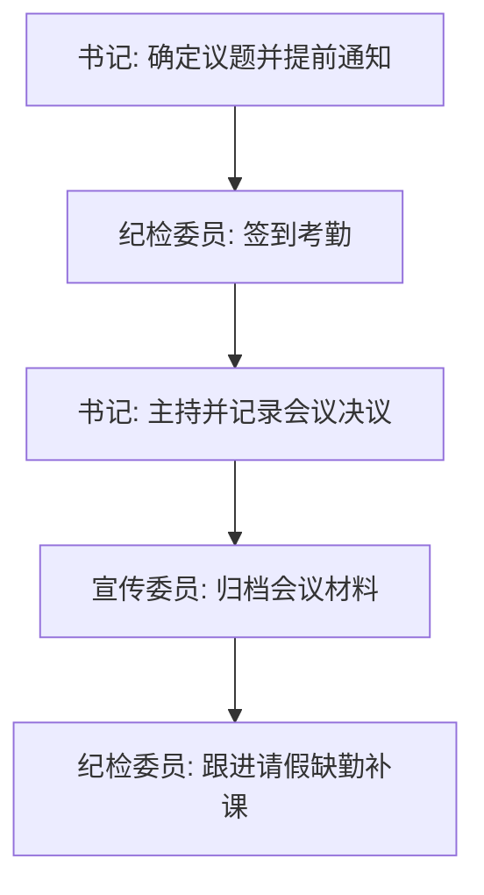

### 线上支委会链路（通用）

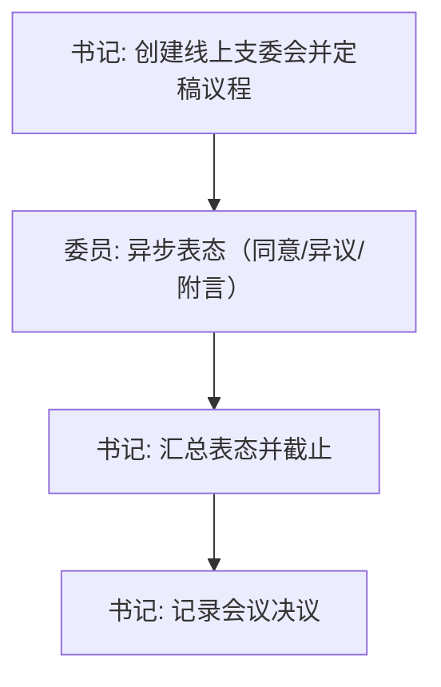

### 党小组会链路（通用）

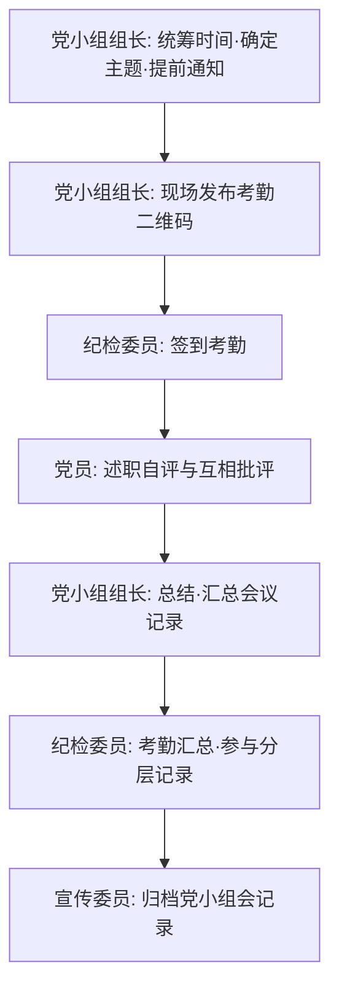

### 党课链路（通用）

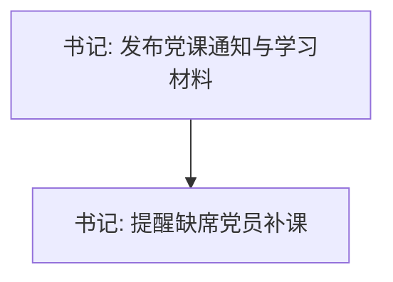

### 主题党日链路（通用）

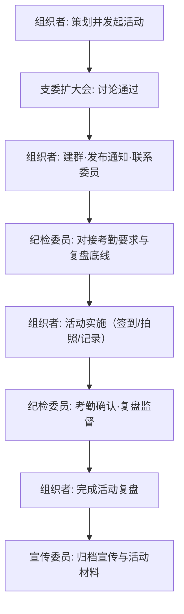

### 支部党员大会链路（通用）

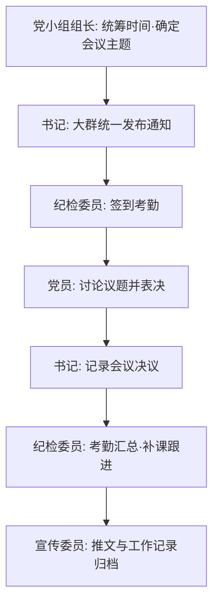

### 专班链路（通用）

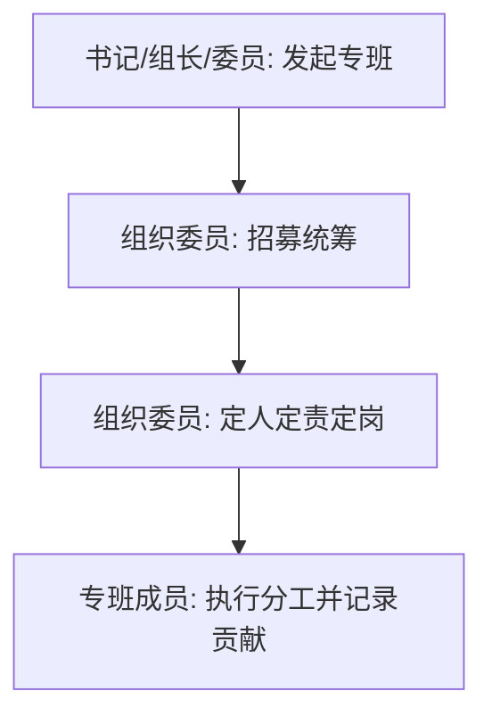

### 发展党员链路（通用）

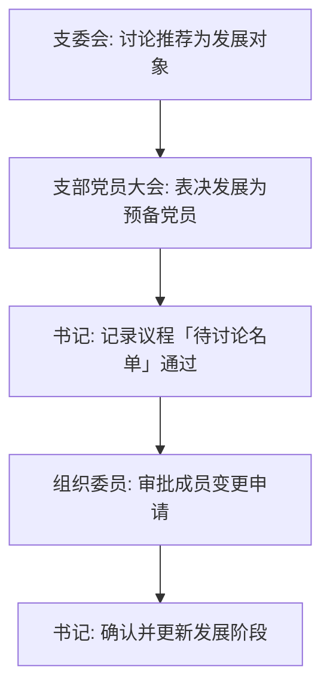

### 考察积极分子链路（通用）

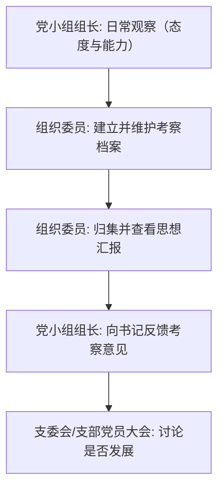

### 制度制定与迭代链路（通用）

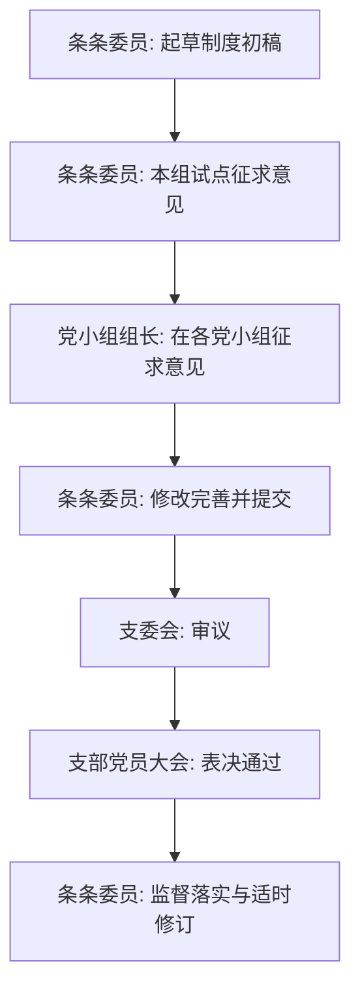

### 补课回写链路（特有）

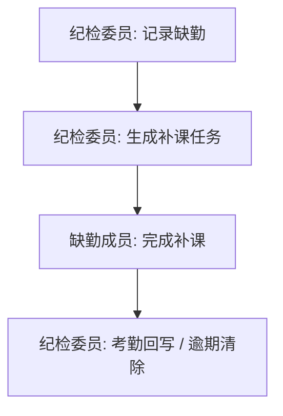

### 思想汇报链路（通用）

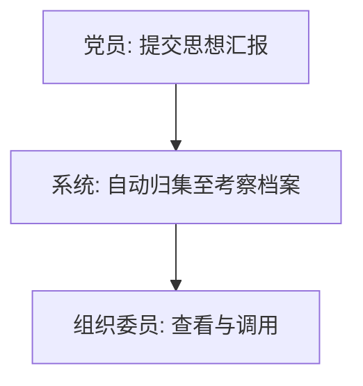

## 架构分层

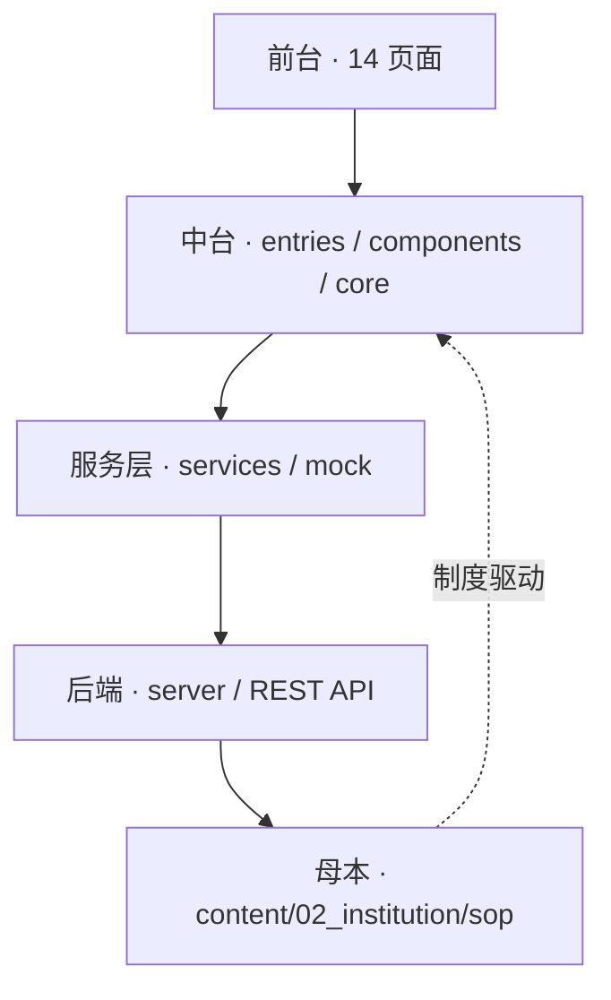

## 服务依赖

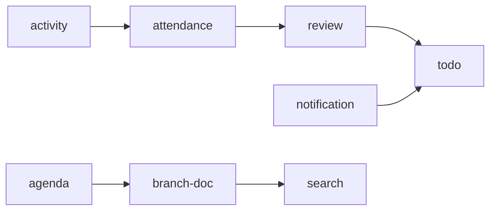
