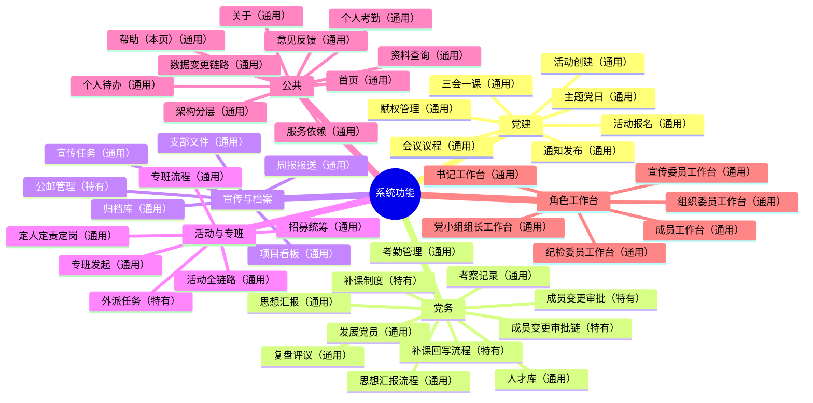
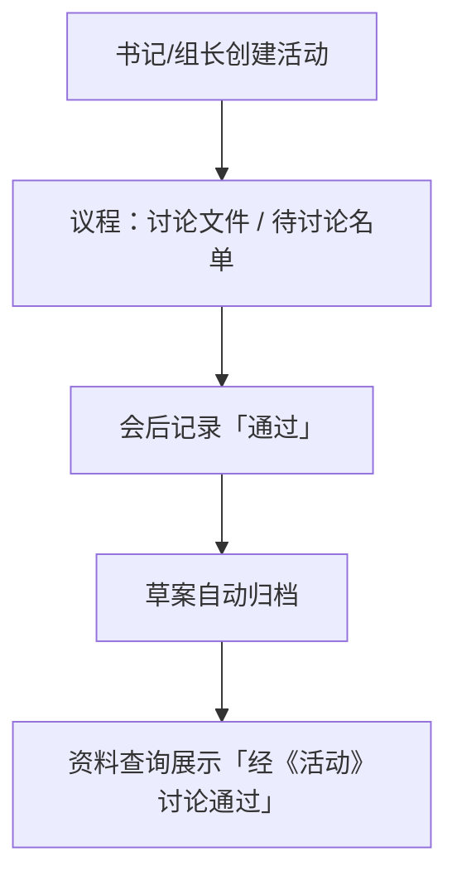
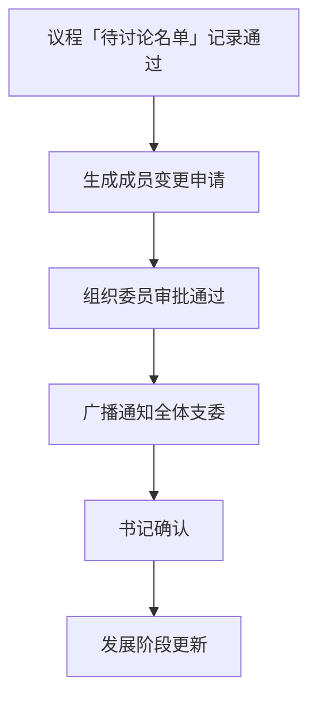
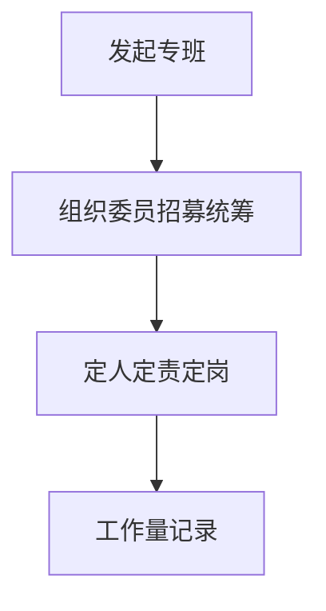
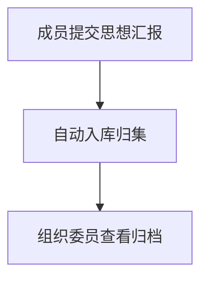
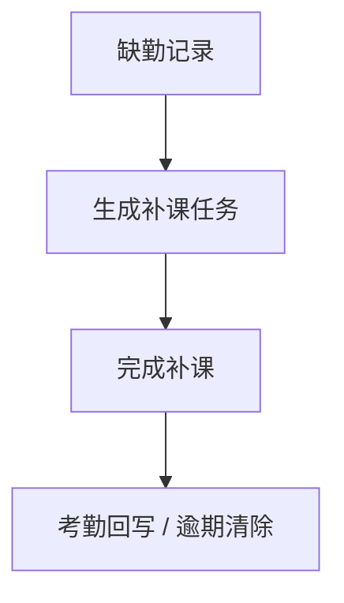
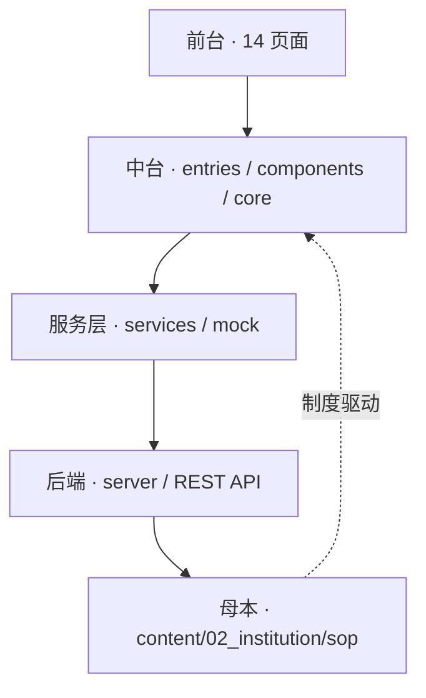
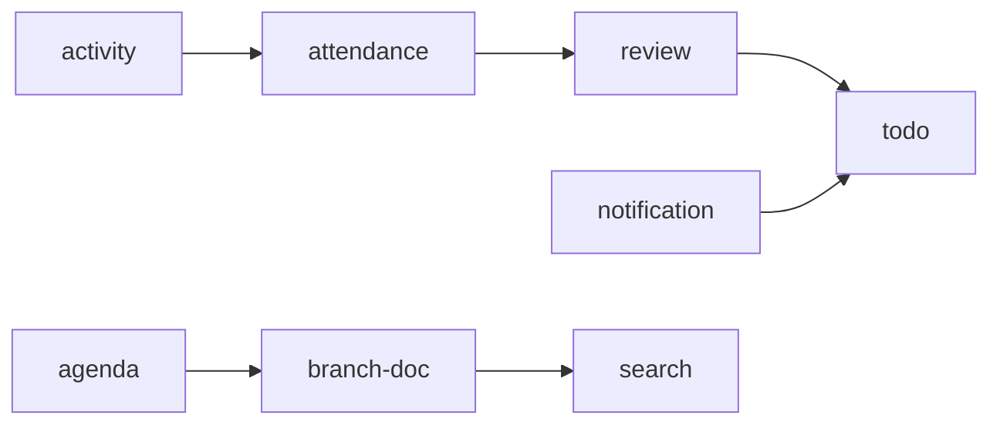

# 系统功能地图与服务逻辑（FUNCTION_MAP）

> 本文件由 `node docs/scripts/gen-function-mermaid.mjs --write` 自动生成，勿手改；功能清单以 `docs/src/core/function-catalog.js` 为准。

## 功能地图

通用能力与支部特有以下方（通用）/（特有）文本标注区分。

## 业务链路

### 活动全链路（通用）

### 成员变更审批链（特有）

### 专班流程（通用）

### 思想汇报流程（通用）

### 补课回写流程（特有）

## 架构分层

## 服务依赖

