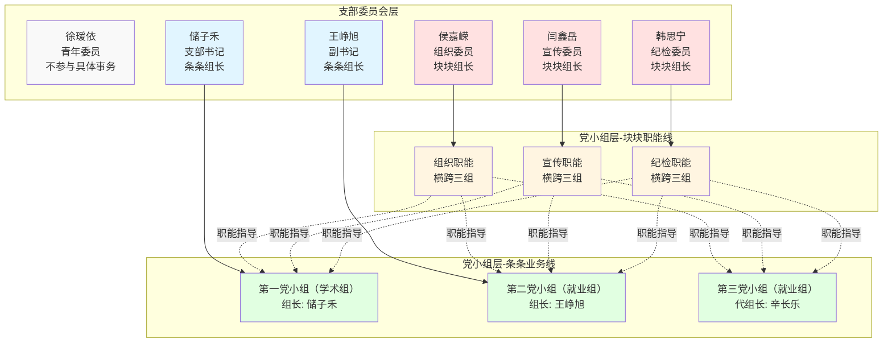
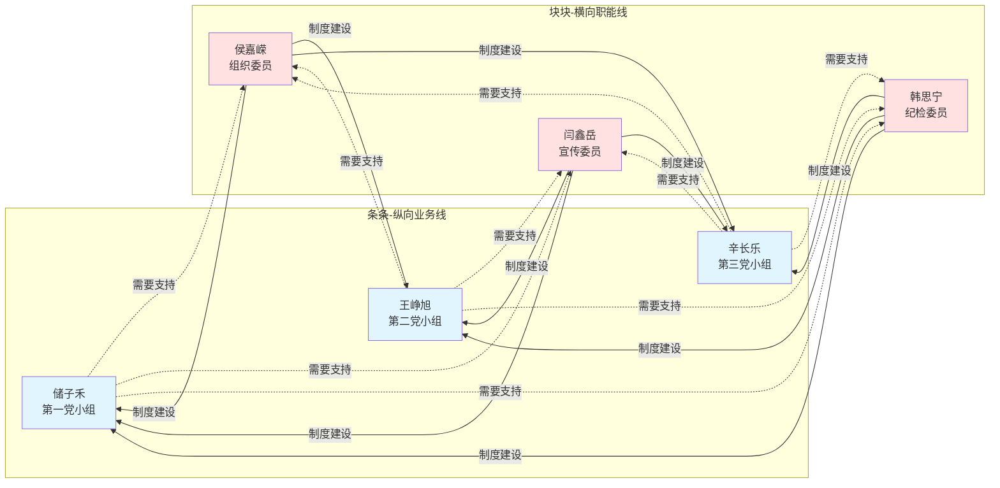
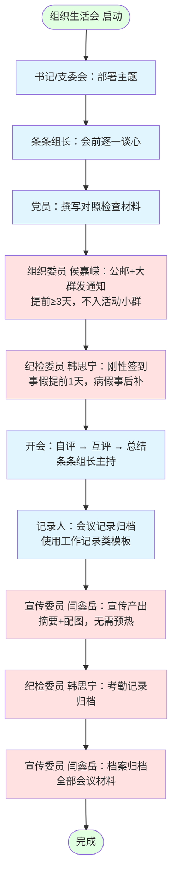
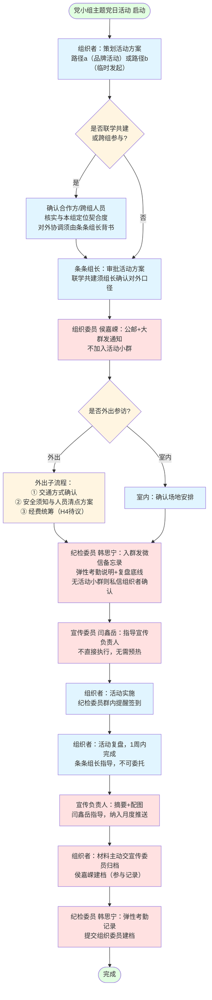
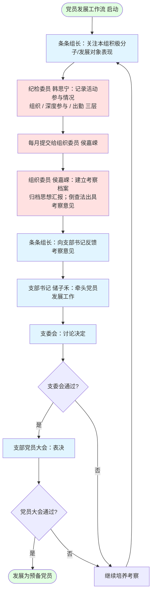
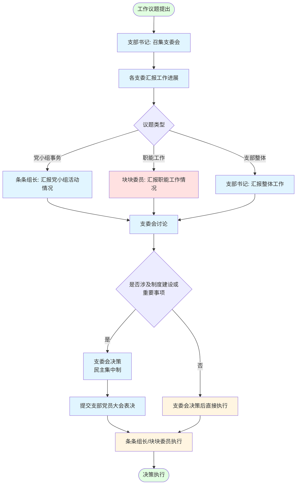
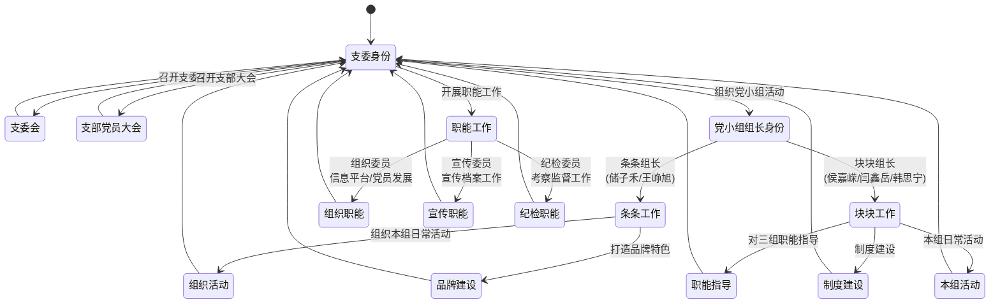
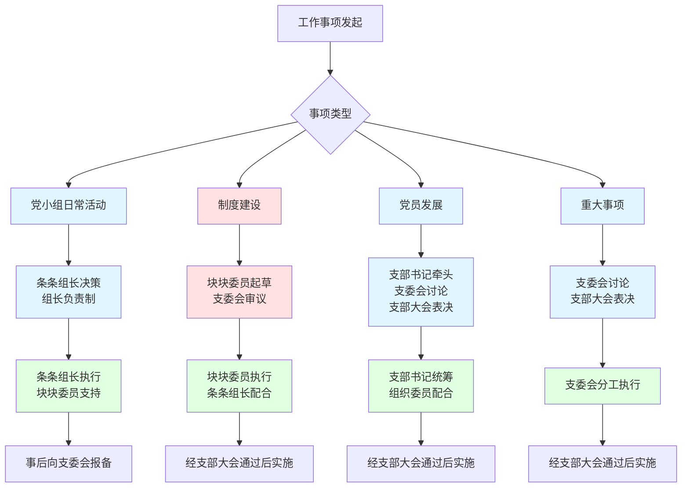

# 支委与党小组工作流程图

本文档包含多个流程图，展示支委与党小组的定人定责定岗工作机制。§3–5 为三大核心活动骨架（以奥卡姆剃刀原则聚合），§6–10 为保留的架构参考或治理流程，各附保留说明。

## 📋 目录

1. [组织架构与双重身份体系图](#1-组织架构与双重身份体系图)
2. [条条与块块协作机制图](#2-条条与块块协作机制图)
3. [[骨架 I] 组织生活会标准工作流](#3-骨架-i-组织生活会标准工作流)
4. [[骨架 II] 党小组主题党日活动标准工作流](#4-骨架-ii-党小组主题党日活动标准工作流)
5. [[骨架 III] 党员发展与考察工作流](#5-骨架-iii-党员发展与考察工作流)
6. [制度建设流程](#6-制度建设流程)
7. [支委会决策流程](#7-支委会决策流程)
8. [双重身份职责切换示意图](#8-双重身份职责切换示意图)
9. [工作事项责任分工矩阵](#9-工作事项责任分工矩阵)
10. [关键决策点与权限分配](#10-关键决策点与权限分配)
11. [使用说明](#使用说明)

---

## 1. 组织架构与双重身份体系图

> **保留说明：** 本图为结构性参考图，展示双重身份体系（条条/块块），不属于任何活动工作流，是新成员了解组织架构的首选入口。

**说明：**
- 🔵 蓝色：支部书记、副书记（条条组长）
- 🔴 红色：三位委员（块块组长）
- 🟢 绿色：三个党小组
- 🟡 黄色：职能线
- 虚线表示职能指导关系

## 2. 条条与块块协作机制图

> **保留说明：** 本图为角色机制图，展示条条需要支持时的协作关系，是架构参考而非工作流，不属于三大骨架，作为块块职能指导的全局索引使用。

**说明：**
- 条条组长负责具体活动组织，需要时向块块委员寻求支持
- 块块委员负责制度建设，对三个党小组进行横向指导

---

## 3. [骨架 I] 组织生活会标准工作流

> **适用范围：** 三会一课范畴的组织生活会（含民主生活会、批评与自我批评会）。  
> **参与者：** 中共党员与预备党员。  
> **考勤：** 刚性（三会一课），必须记录归档。  
> **主导：** 书记/支委会部署主题，条条组长主持。

**重要说明：**
- 🔴 红色节点为块块委员职能动作；🔵 蓝色节点为条条/党员动作
- 组织生活会**不需要**活动复盘，使用「工作记录类」模板归档即可
- 纪检委员考勤为刚性，必须记录并归档以证明会议召开

---

## 4. [骨架 II] 党小组主题党日活动标准工作流

> **适用范围：** 三会一课以外的学习型、交流型、实践型活动（学习会、分享会、参访、联学共建等）。  
> **参与者：** 全体支部成员，可跨组。  
> **考勤：** 弹性（组织者/深度参与者必须，一般参与者以鼓励为主）。  
> **主导：** 条条组长审批，组织者主导执行。  
> **合并说明：** 原"党团班一体化活动流程"已整合入本骨架 **分支 2（联学共建/跨组）**，不单独成图。

**条条断点说明（详见 `REVIEW_STATE.md` §悬置问题）：**
- **H4（新增悬置）**：外出子流程中，经费统筹的审批链路不明——条条组长审批上限为多少？何时须报支委会？"支部经费管理规定"尚未建立。
- **H1（已悬置）**：联学共建/跨组时，组织者的考察协同问题待定。

---

## 5. [骨架 III] 党员发展与考察工作流

> **核心枢纽：** 组织委员侯嘉嵘作为数据终极汇聚点；纪检委员韩思宁只负责现场记录与移交，不建档。

**重要说明：**
- 纪检委员**只负责记录并移交**，不建立考察档案（2026年2月已将建档职能转给组织委员）
- 组织委员采用**倒查法**：党员发展申请时，根据其自述倒查考察档案中的三层记录

---

## 6. 制度建设流程

> **保留说明：** 制度建设是独立的治理工作流，面向全支部所有活动类型，属块块委员职能范畴，不属于三大活动骨架。独立保留供块块委员推进制度时查阅。

## 7. 支委会决策流程

> **保留说明：** 支委会决策是支部治理的核心决策机制，跨越所有活动类型与工作场景，不属于任何单一活动骨架。独立保留便于支委查阅议事规则。

## 8. 双重身份职责切换示意图

> **保留说明：** 本图展示支委与党小组组长双重身份的切换逻辑，是组织架构补充参考，与活动工作流正交，不属于三大骨架。

## 9. 工作事项责任分工矩阵

| 工作事项 | 主责人 | 身份 | 协作人 | 工作场景 |
|---------|--------|------|--------|----------|
| 召集支委会 | 储子禾 | 支部书记 | 王峥旭 | 支委会 |
| 召集支部大会 | 储子禾 | 支部书记 | 王峥旭 | 支部党员大会 |
| 党员发展 | 储子禾 | 支部书记 | 侯嘉嵘 | 支委会决策 |
| 第一党小组活动 | 储子禾 | 条条组长 | 三位块块委员 | 党小组会 |
| 第二党小组活动 | 王峥旭 | 条条组长 | 三位块块委员 | 党小组会 |
| 第三党小组活动 | 辛长乐 | 条条代组长 | 三位块块委员 | 党小组会 |
| 信息平台建设 | 侯嘉嵘 | 组织委员 | - | 职能工作 |
| 思想汇报归档 | 侯嘉嵘 | 组织委员 | - | 职能工作 |
| 考察档案建立 | 侯嘉嵘 | 组织委员 | 韩思宁（提交记录） | 职能工作 |
| 宣传档案工作 | 闫鑫岳 | 宣传委员 | - | 职能工作 |
| 宣传档案队伍建设 | 闫鑫岳 | 宣传委员 | - | 职能工作 |
| 三会一课考勤管理 | 韩思宁 | 纪检委员 | - | 职能工作 |
| 活动参与记录 | 韩思宁 | 纪检委员 | 侯嘉嵘（接收建档） | 职能工作 |
| 补课制度执行 | 韩思宁 | 纪检委员 | - | 职能工作 |
| 意见反馈平台 | 韩思宁 | 纪检委员 | - | 职能工作 |
| 团学工作指导 | 徐瑗依 | 青年委员 | - | 团学指导 |

## 10. 关键决策点与权限分配

> **保留说明：** 本图展示各类事项的决策权归属（条条/块块/支委会），是治理参考，不属于具体活动工作流。与§7（支委会决策）形成总-分关系：§10给出决策类型路由，§7展示支委会内部议事细节。

## 使用说明

### 图例说明
- **🔵 蓝色**：支部书记、副书记及其相关工作（条条组长）
- **🔴 红色**：组织委员、宣传委员、纪检委员及其职能工作（块块委员）
- **🟢 绿色**：活动起止节点
- **🟡 黄色**：条件判断节点（菱形）或职能支撑节点
- **⚪ 灰色**：特殊情况（教师等）

### 核心骨架快查

| 活动类型 | 对应骨架 | 考勤类型 | 侯嘉嵘角色 | 韩思宁角色 |
|---------|---------|---------|-----------|-----------|
| 组织生活会 | 骨架 I（§3） | 刚性 | 公域发令（公邮+大群） | 刚性签到+归档 |
| 党小组主题党日活动 | 骨架 II（§4） | 弹性 | 公域发令（不入群） | 私域入群督办 |
| 党员发展与考察 | 骨架 III（§5） | — | 数据枢纽/建档 | 现场记录→移交 |

### 适用场景
1. **新支委学习**：从§1组织架构图开始，了解双重身份体系
2. **党小组组长**：重点查看§3（组织生活会）和§4（党小组主题党日活动）
3. **块块委员**：重点查看§6制度建设流程和§2条条块块协作机制
4. **积极分子**：查看§5党员发展与考察工作流

### 工作原则
1. **条条主导活动，块块提供支撑**
2. **支委决策为先，党小组落实为主**
3. **制度建设归块块，具体执行看条条**
4. **民主集中制贯穿始终**

---

**文档版本：** v1.2  
**更新日期：** 2026年2月28日  
**维护者：** 光华管理学院本科生党支部
