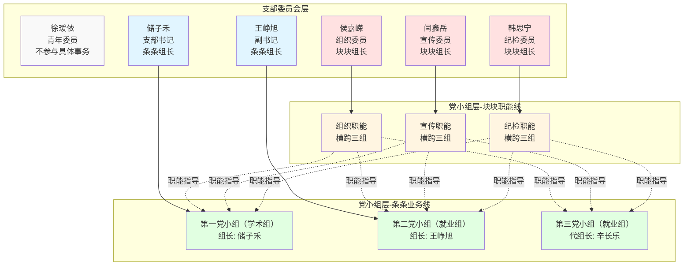
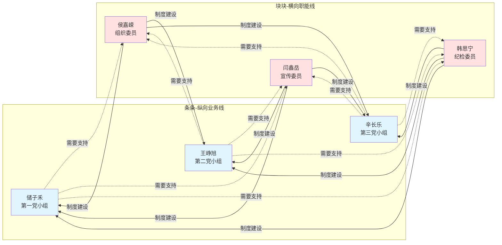
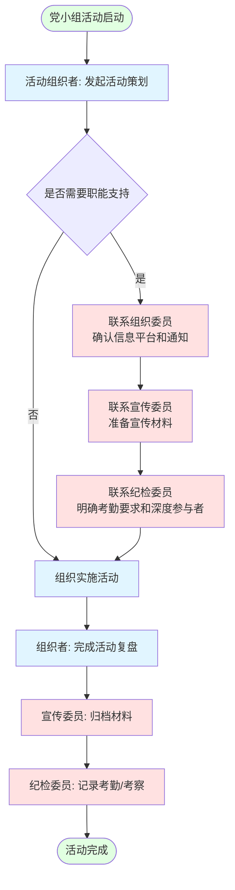
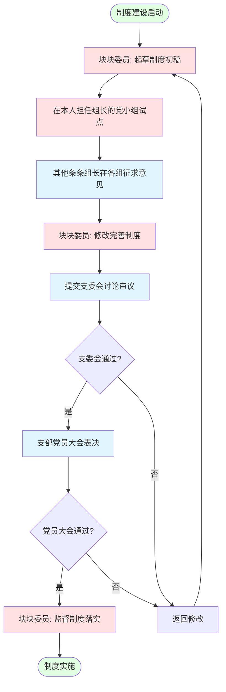
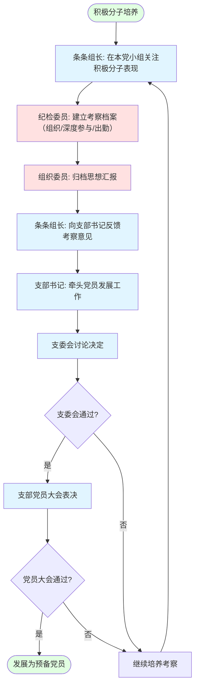
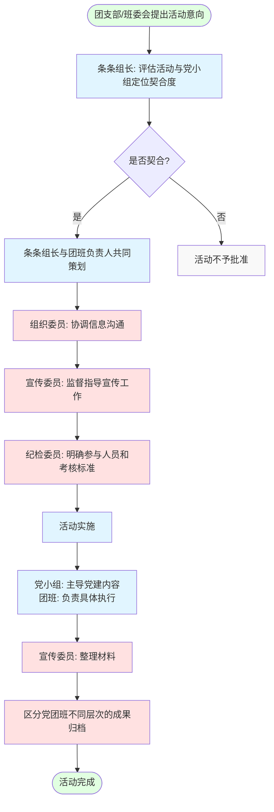
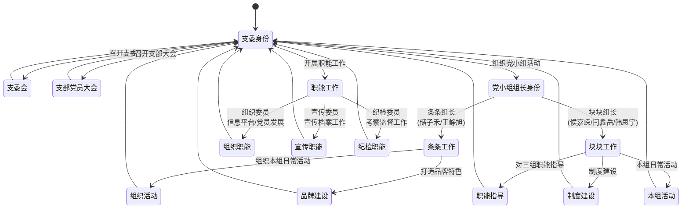
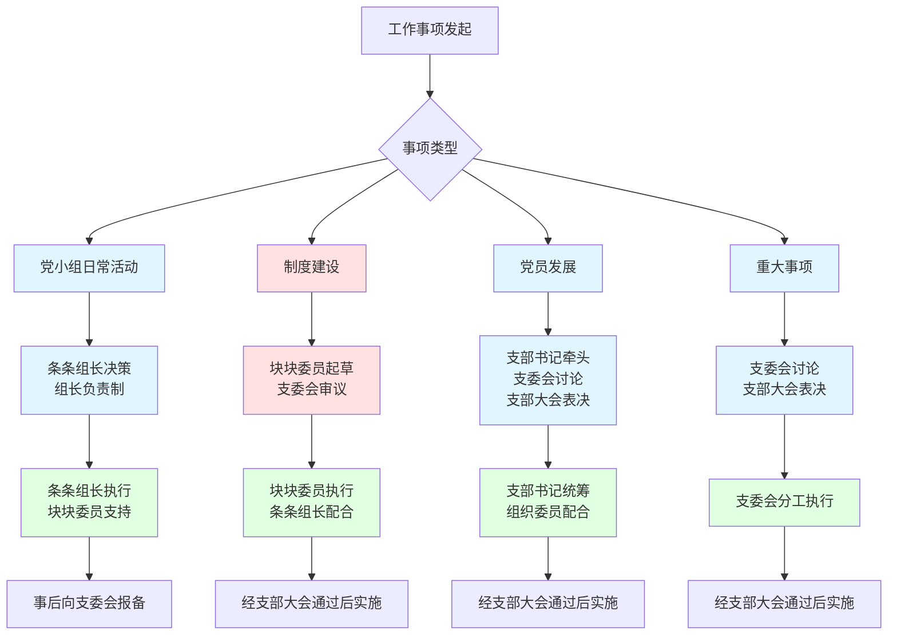

# 支委与党小组工作流程图

本文档包含多个流程图，展示支委与党小组的定人定责定岗工作机制。

## 📋 目录

1. [组织架构与双重身份体系图](#1-组织架构与双重身份体系图)
2. [条条与块块协作机制图](#2-条条与块块协作机制图)
3. [党小组活动组织流程](#3-党小组活动组织流程)
4. [制度建设流程](#4-制度建设流程)
5. [积极分子考察与发展流程](#5-积极分子考察与发展流程)
6. [党团班一体化活动流程](#6-党团班一体化活动流程)
7. [支委会决策流程](#7-支委会决策流程)
8. [双重身份职责切换示意图](#8-双重身份职责切换示意图)
9. [工作事项责任分工矩阵](#9-工作事项责任分工矩阵)
10. [关键决策点与权限分配](#10-关键决策点与权限分配)
11. [使用说明](#使用说明)

---

## 1. 组织架构与双重身份体系图

**说明：**
- 🔵 蓝色：支部书记、副书记（条条组长）
- 🔴 红色：三位委员（块块组长）
- 🟢 绿色：三个党小组
- 🟡 黄色：职能线
- 虚线表示职能指导关系

## 2. 条条与块块协作机制图

**说明：**
- 条条组长负责具体活动组织，需要时向块块委员寻求支持
- 块块委员负责制度建设，对三个党小组进行横向指导

## 3. 党小组活动组织流程

**重要说明：**
- 活动组织者不一定是党小组组长或支委
- 组织者一般为支部党员（党员或预备党员）
- 支持项目制，鼓励灵活组织
- 这是考察积极分子和发展对象的重点场域

---

## 4. 制度建设流程

## 5. 积极分子考察与发展流程

## 6. 党团班一体化活动流程

## 7. 支委会决策流程

## 8. 双重身份职责切换示意图

## 9. 工作事项责任分工矩阵

| 工作事项 | 主责人 | 身份 | 协作人 | 工作场景 |
|---------|--------|------|--------|----------|
| 召集支委会 | 储子禾 | 支部书记 | 王峥旭 | 支委会 |
| 召集支部大会 | 储子禾 | 支部书记 | 王峥旭 | 支部党员大会 |
| 党员发展 | 储子禾 | 支部书记 | 侯嘉嵘 | 支委会决策 |
| 第一党小组活动 | 储子禾 | 条条组长 | 三位块块委员 | 党小组会 |
| 第二党小组活动 | 王峥旭 | 条条组长 | 三位块块委员 | 党小组会 |
| 第三党小组活动 | 辛长乐 | 条条代组长 | 三位块块委员 | 党小组会 |
| 信息平台建设 | 侯嘉嵘 | 组织委员 | - | 职能工作 |
| 思想汇报归档 | 侯嘉嵘 | 组织委员 | - | 职能工作 |
| 党小组工作流建设 | 侯嘉嵘/韩思宁 | 组织/纪检委员 | - | 职能工作 |
| 宣传档案工作 | 闫鑫岳 | 宣传委员 | - | 职能工作 |
| 宣传档案队伍建设 | 闫鑫岳 | 宣传委员 | - | 职能工作 |
| 考察制度建设 | 韩思宁 | 纪检委员 | - | 职能工作 |
| 监督议事制度建设 | 韩思宁 | 纪检委员 | - | 职能工作 |
| 出勤补课规范 | 韩思宁 | 纪检委员 | - | 职能工作 |
| 团学工作指导 | 徐瑗依 | 青年委员 | - | 团学指导 |

## 10. 关键决策点与权限分配

## 使用说明

### 图例说明
- **🔵 蓝色**：支部书记、副书记及其相关工作（条条组长）
- **🔴 红色**：组织委员、宣传委员、纪检委员及其职能工作（块块委员）
- **🟢 绿色**：党小组活动和成果
- **🟡 黄色**：职能支撑工作
- **⚪ 灰色**：教师指导或特殊情况

### 适用场景
1. **新支委学习**：从组织架构图开始，了解双重身份体系
2. **党小组组长**：重点查看党小组活动流程和党团班一体化流程
3. **块块委员**：重点查看制度建设流程和职能指导关系
4. **积极分子**：查看积极分子考察与发展流程

### 工作原则
1. **条条主导活动，块块提供支撑**
2. **支委决策为先，党小组落实为主**
3. **制度建设归块块，具体执行看条条**
4. **民主集中制贯穿始终**

---

**文档版本：** v1.0  
**更新日期：** 2026年2月  
**维护者：** 光华管理学院本科生党支部
